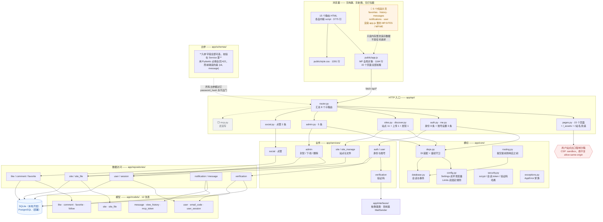

# 架构

> 只描述**现在是什么样**，不描述应该是什么样。
> 图的约定见 [`README.md`](README.md)。

## 一句话概括

**前端没变，后端换了一遍语言。** 前端仍是 15 个**无构建、无依赖**的静态 HTML，
各自内联脚本，共享一个 `public/app.js`（1164 行）。

后端从「一个 2023 行的 `server.js` + 13 个 `lib/*`」换成了
**Python + FastAPI 的四层结构**（`api → services → repositories → models`），
分层由 `import-linter` 和 AST 测试**强制**，不是靠自觉。

## 规模

| 部位 | 量 |
|---|---|
| 后端 `app/` | 56 个文件、6574 行 |
| 后端 `tests/` | 10 个文件、2522 行 |
| 后端 `tools/` | 3 个文件、851 行 |
| 前端 | 15 个 HTML（3775 行）+ `app.js` 1164 行 + `style.css` 1391 行 |
| 接口 | **31 个路径**（`/api/*` 全部落地，还剩 MCP 5 条） |
| 数据表 | 12 张 |
| 运行时依赖 | FastAPI · SQLAlchemy · Pydantic · uvicorn · psycopg · alembic · nodemailer 的等价物（SMTP） |
| 旧 Node 后端 | `server.js` 2023 行 + `lib/` 13 个文件 3218 行 —— **仍在仓库里**，作为行为参照 |

> 接口的权威数字看运行中的 OpenAPI，不要数上面的表：
> `curl -s localhost:3000/api/openapi.json | jq '.paths | length'`

## 架构图



## 组织方式（图里看不出来的几条）

### 1. 分层是**强制**的，靠两条独立实现互相兜底

```
api → services → repositories → models
core / interfaces / schemas 横切
```

- `import-linter` 的 contract 检查（跑在 preflight 里）
- `tests/test_layering.py` 用 AST 独立检查一遍

**两条是刻意重复的**：import-linter 的配置写在 `pyproject.toml` 里，容易被误改；
AST 测试是代码，改它更显眼。任一条漏了另一条还在。

`api` 不许直接 import `repositories` 或 `models` —— 绕过 Service 就等于没有业务层。

### 2. **事务边界在 Service 层**，而且提交发生在响应之前

Repository 只负责「把语句发出去」，什么时候提交由 Service 决定。

⚠️ 这里踩过一个坑，值得单独记住：**提交原本挂在 FastAPI 的 `yield` 依赖 teardown 上，
而那个 teardown 是在响应发出之后才跑的。** 实测：探针里 teardown 睡 0.5 秒，
客户端 0.039 秒就收到了响应。

后果是「响应说成功、数据还没落库」—— 真实浏览器里点完「封禁」立刻刷新，
徽章还是「正常」。全量细节与修法见 `../app/core/routing.py` 开头的说明。

**这个 bug 用 `TestClient` 测不出来**（它完全同步，窗口被压成零），
所以守门的是 `tools/verify_upload_chain.py` 第 8 节那个打真实服务的检查。

### 3. 前端没有任何取数层（**没变**）

没有组件、没有路由、没有 store。每个页面自己画 DOM、自己 `fetch`。

**这是「演示页能长期藏着不被人发现」的结构性原因** —— 页面之间没有共同的取数层，
接没接只能一页一页看。重写后端没有改变这一点。

当前状态（`tests/scripts/link-coverage.mjs` 可复现）：

| 状态 | 页面 |
|---|---|
| ✅ 真走后端 | `app.js`（顶栏/登录）· `index`（已并入创作页）· `sites` · `site` · `discover` · `account` · `forgot` · `view` |
| 🔶 纯演示 | `favorites` · `history` · `messages` · `notifications` · `user` |
| ⬜ 后端没写 | `admin.html` 的表格已通；`settings.html` 的 MCP 密钥区还打不到 |

`login.html` 自己没有 `fetch`，但它通过 `app.js` 的共享表单间接走后端 —— 算 ✅。

### 4. 用户站点有两条存储路径（历史包袱，**照抄了**）

| 形态 | 内容存哪 | 单文件上限 |
|---|---|---|
| 单页站（老） | `sites.html` 列 | 2 MB |
| 多页站（新） | `site_files.content`（BLOB） | 10 MB |

所以同一个 `index.html` 走两条路时上限不一样。判据是**文件数**，不是 `html` 是否为空
（多页站建站时会塞一个空字符串占位）。

### 5. MCP 是旁路，**还没重写**

`lib/mcp/*` 在 Node 版里直接调 `lib/sites.js`，不经过自己的 HTTP 接口；
凭据是 `mcp_tokens` 表里的密钥（只存 sha256），与登录 Cookie 无关。
Python 版这 5 条还是 ⬜ —— 前端只剩 `settings.html` 的 2 处调用打不到后端。

### 6. 已知的结构性问题（只记录，不在这里解决）

| 问题 | 说明 |
|---|---|
| 两份清单靠人同步 | 前端 `MP.TAGS` 与 `LOGIN_REQUIRED` 各有一份和服务端对应的表，已经漂移过一次 |
| 没有取数层 | 见上第 3 条 |
| 单页站 / 多页站双轨 | 见上第 4 条，上限与行为不一致 |
| 浏览量口径粗糙 | 只在访问入口页时 +1，不去重、不防刷 |
| **首页卡片点不动** | `MP.vcard` 生成的卡片是 `div`，**封面那一大块没有链接**，只有 `.vtitle` 这个小链接可点。用户点封面会以为卡片坏了。同样地，卡片上的快捷赞/藏**只 toggle 一个 class、不发请求** |
| 两个状态接口的默认值危险 | 只认 `banned` / `offline`，其它一切值**静默**变成正常值。照抄了原版，已用测试钉住 |
| 提交时序靠一个自定义路由类 | `CommitBeforeResponseRoute` 必须挂在**每一个** `APIRouter` 上；漏挂不报错，只是那个模块又变回竞态。`tests/test_transactions.py` 静态检查 |
| **23 条接口还在 Node 版里** | MCP 5 + 收藏/关注/评论 9 + 私信/历史/通知 9。表都建好了，缺仓储写方法 + Service + 路由 |

> **「页面上存在 `a[href=/站名]`」不等于「卡片能点」。** 自动化检查如果只断言链接存在，
> 就会漏掉上面那条 —— 本项目的 `e2e-upload-py.mjs` 一度就是这么写的，
> 现在的断言名已改成「点**标题链接**」，另用 `audit-like-and-cards.mjs` 单独验点卡片本体。

缺陷清单在 `../../docs/rewrite/`（`new-findings.md` 21 条、`issues.md` 53 条），
已进版本控制，可以直接链接。
