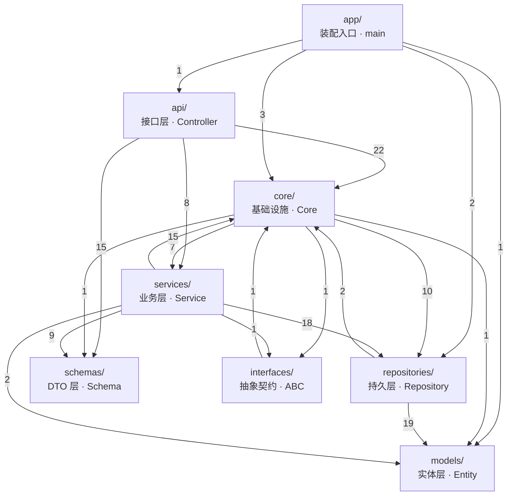

# 后端目录依赖链（**自动生成，不要手改**）

> 由 `tools/gen_dep_graph.py` 从代码里真实解析 import 生成。
> 改了代码不同步更新这个文件，`tests/test_dep_graph.py` 会红。
> 重新生成：`.venv/Scripts/python.exe tools/gen_dep_graph.py`

统计：**56** 个 Python 文件，**185** 条文件间依赖。

## 一、层依赖（7 个包之间）

箭头上的数字是**跨层的文件级依赖条数**。

### ✅ 层依赖方向检查

所有跨层依赖都在允许范围内（见 `pyproject.toml` 的 import-linter 契约）。

### 已知例外（跨层，但**逐个登记过理由**）

| 文件 | 跨的层 | 为什么允许 |
|---|---|---|
| `app/core/deps.py` | core → interfaces | 依赖注入装配点 —— 它的职责就是「把各层接起来」 |
| `app/core/deps.py` | core → repositories | 依赖注入装配点 —— 它的职责就是「把各层接起来」 |
| `app/core/deps.py` | core → schemas | 依赖注入装配点 —— 它的职责就是「把各层接起来」 |
| `app/core/deps.py` | core → services | 依赖注入装配点 —— 它的职责就是「把各层接起来」 |

> 为什么不把这几条直接加进 `ALLOWED`：那样会把**整层**的规则放宽，
> 以后 `core/` 下任何一个新文件都能偷偷 import `services`。
> 按文件登记，**破例的人必须知道自己在破例** —— 名单在 `tools/gen_dep_graph.py` 的 `EXEMPT`。

## 二、文件依赖（按层分组）

```mermaid
flowchart TD
    subgraph sg_app["app/ · 装配入口 · main"]
        direction TB
        f_app___init__["__init__.py"]
        f_app_main["main.py"]
    end
    subgraph sg_api["api/ · 接口层 · Controller"]
        direction TB
        f_app_api___init__["__init__.py"]
        f_app_api_admin["admin.py"]
        f_app_api_auth["auth.py"]
        f_app_api_cookies["cookies.py"]
        f_app_api_discover["discover.py"]
        f_app_api_health["health.py"]
        f_app_api_me["me.py"]
        f_app_api_pages["pages.py"]
        f_app_api_router["router.py"]
        f_app_api_sites["sites.py"]
        f_app_api_social["social.py"]
    end
    subgraph sg_services["services/ · 业务层 · Service"]
        direction TB
        f_app_services___init__["__init__.py"]
        f_app_services_admin_service["admin_service.py"]
        f_app_services_auth_service["auth_service.py"]
        f_app_services_site_manage_service["site_manage_service.py"]
        f_app_services_site_service["site_service.py"]
        f_app_services_social_service["social_service.py"]
        f_app_services_user_service["user_service.py"]
        f_app_services_verification_service["verification_service.py"]
    end
    subgraph sg_repositories["repositories/ · 持久层 · Repository"]
        direction TB
        f_app_repositories___init__["__init__.py"]
        f_app_repositories_base["base.py"]
        f_app_repositories_comment_repository["comment_repository.py"]
        f_app_repositories_favorite_repository["favorite_repository.py"]
        f_app_repositories_like_repository["like_repository.py"]
        f_app_repositories_message_repository["message_repository.py"]
        f_app_repositories_notification_repository["notification_repository.py"]
        f_app_repositories_session_repository["session_repository.py"]
        f_app_repositories_site_file_repository["site_file_repository.py"]
        f_app_repositories_site_repository["site_repository.py"]
        f_app_repositories_user_repository["user_repository.py"]
        f_app_repositories_verification_repository["verification_repository.py"]
    end
    subgraph sg_models["models/ · 实体层 · Entity"]
        direction TB
        f_app_models___init__["__init__.py"]
        f_app_models_base["base.py"]
        f_app_models_message["message.py"]
        f_app_models_site["site.py"]
        f_app_models_social["social.py"]
        f_app_models_user["user.py"]
    end
    subgraph sg_schemas["schemas/ · DTO 层 · Schema"]
        direction TB
        f_app_schemas___init__["__init__.py"]
        f_app_schemas_admin["admin.py"]
        f_app_schemas_auth["auth.py"]
        f_app_schemas_common["common.py"]
        f_app_schemas_me["me.py"]
        f_app_schemas_site["site.py"]
        f_app_schemas_social["social.py"]
        f_app_schemas_user["user.py"]
    end
    subgraph sg_interfaces["interfaces/ · 抽象契约 · ABC"]
        direction TB
        f_app_interfaces___init__["__init__.py"]
        f_app_interfaces_mail_sender["mail_sender.py"]
    end
    subgraph sg_core["core/ · 基础设施 · Core"]
        direction TB
        f_app_core___init__["__init__.py"]
        f_app_core_config["config.py"]
        f_app_core_database["database.py"]
        f_app_core_deps["deps.py"]
        f_app_core_exceptions["exceptions.py"]
        f_app_core_routing["routing.py"]
        f_app_core_security["security.py"]
    end

    f_app_api___init__ --> f_app_api_router
    f_app_api_admin --> f_app_core_deps
    f_app_api_admin --> f_app_core_routing
    f_app_api_admin --> f_app_schemas_admin
    f_app_api_admin --> f_app_schemas_user
    f_app_api_admin --> f_app_services_admin_service
    f_app_api_auth --> f_app_api_cookies
    f_app_api_auth --> f_app_core_deps
    f_app_api_auth --> f_app_core_routing
    f_app_api_auth --> f_app_schemas_auth
    f_app_api_auth --> f_app_schemas_common
    f_app_api_auth --> f_app_schemas_user
    f_app_api_auth --> f_app_services_auth_service
    f_app_api_cookies --> f_app_core_config
    f_app_api_cookies --> f_app_core_security
    f_app_api_discover --> f_app_core_config
    f_app_api_discover --> f_app_core_deps
    f_app_api_discover --> f_app_core_routing
    f_app_api_discover --> f_app_schemas_site
    f_app_api_discover --> f_app_services_site_service
    f_app_api_health --> f_app_core_database
    f_app_api_health --> f_app_core_routing
    f_app_api_me --> f_app_core_deps
    f_app_api_me --> f_app_core_routing
    f_app_api_me --> f_app_schemas_common
    f_app_api_me --> f_app_schemas_me
    f_app_api_me --> f_app_schemas_user
    f_app_api_me --> f_app_services_user_service
    f_app_api_pages --> f_app_core_config
    f_app_api_pages --> f_app_core_deps
    f_app_api_pages --> f_app_core_routing
    f_app_api_pages --> f_app_schemas_user
    f_app_api_pages --> f_app_services_site_service
    f_app_api_router --> f_app_api___init__
    f_app_api_router --> f_app_core_routing
    f_app_api_sites --> f_app_core_config
    f_app_api_sites --> f_app_core_deps
    f_app_api_sites --> f_app_core_routing
    f_app_api_sites --> f_app_schemas_common
    f_app_api_sites --> f_app_schemas_site
    f_app_api_sites --> f_app_schemas_user
    f_app_api_sites --> f_app_services_site_manage_service
    f_app_api_sites --> f_app_services_site_service
    f_app_api_social --> f_app_core_deps
    f_app_api_social --> f_app_core_routing
    f_app_api_social --> f_app_schemas_social
    f_app_api_social --> f_app_schemas_user
    f_app_api_social --> f_app_services_social_service
    f_app_core_database --> f_app_core_config
    f_app_core_deps --> f_app_core_config
    f_app_core_deps --> f_app_core_database
    f_app_core_deps --> f_app_core_exceptions
    f_app_core_deps --> f_app_interfaces_mail_sender
    f_app_core_deps --> f_app_models_user
    f_app_core_deps --> f_app_repositories_comment_repository
    f_app_core_deps --> f_app_repositories_favorite_repository
    f_app_core_deps --> f_app_repositories_like_repository
    f_app_core_deps --> f_app_repositories_message_repository
    f_app_core_deps --> f_app_repositories_notification_repository
    f_app_core_deps --> f_app_repositories_session_repository
    f_app_core_deps --> f_app_repositories_site_file_repository
    f_app_core_deps --> f_app_repositories_site_repository
    f_app_core_deps --> f_app_repositories_user_repository
    f_app_core_deps --> f_app_repositories_verification_repository
    f_app_core_deps --> f_app_schemas_user
    f_app_core_deps --> f_app_services_admin_service
    f_app_core_deps --> f_app_services_auth_service
    f_app_core_deps --> f_app_services_site_manage_service
    f_app_core_deps --> f_app_services_site_service
    f_app_core_deps --> f_app_services_social_service
    f_app_core_deps --> f_app_services_user_service
    f_app_core_deps --> f_app_services_verification_service
    f_app_interfaces___init__ --> f_app_interfaces_mail_sender
    f_app_interfaces_mail_sender --> f_app_core_config
    f_app_main --> f_app___init__
    f_app_main --> f_app_api_router
    f_app_main --> f_app_core_config
    f_app_main --> f_app_core_database
    f_app_main --> f_app_core_exceptions
    f_app_main --> f_app_models___init__
    f_app_main --> f_app_repositories_session_repository
    f_app_main --> f_app_repositories_user_repository
    f_app_models___init__ --> f_app_models_base
    f_app_models___init__ --> f_app_models_message
    f_app_models___init__ --> f_app_models_site
    f_app_models___init__ --> f_app_models_social
    f_app_models___init__ --> f_app_models_user
    f_app_models_message --> f_app_models_base
    f_app_models_site --> f_app_models_base
    f_app_models_social --> f_app_models_base
    f_app_models_user --> f_app_models_base
    f_app_repositories___init__ --> f_app_repositories_base
    f_app_repositories___init__ --> f_app_repositories_like_repository
    f_app_repositories___init__ --> f_app_repositories_session_repository
    f_app_repositories___init__ --> f_app_repositories_site_file_repository
    f_app_repositories___init__ --> f_app_repositories_site_repository
    f_app_repositories___init__ --> f_app_repositories_user_repository
    f_app_repositories_comment_repository --> f_app_models_social
    f_app_repositories_comment_repository --> f_app_repositories_base
    f_app_repositories_favorite_repository --> f_app_models_social
    f_app_repositories_favorite_repository --> f_app_repositories_base
    f_app_repositories_like_repository --> f_app_models_base
    f_app_repositories_like_repository --> f_app_models_social
    f_app_repositories_like_repository --> f_app_repositories_base
    f_app_repositories_message_repository --> f_app_models_message
    f_app_repositories_message_repository --> f_app_repositories_base
    f_app_repositories_notification_repository --> f_app_models_site
    f_app_repositories_notification_repository --> f_app_models_social
    f_app_repositories_notification_repository --> f_app_models_user
    f_app_repositories_notification_repository --> f_app_repositories_base
    f_app_repositories_session_repository --> f_app_core_config
    f_app_repositories_session_repository --> f_app_models_base
    f_app_repositories_session_repository --> f_app_models_user
    f_app_repositories_session_repository --> f_app_repositories_base
    f_app_repositories_site_file_repository --> f_app_models_base
    f_app_repositories_site_file_repository --> f_app_models_site
    f_app_repositories_site_file_repository --> f_app_repositories_base
    f_app_repositories_site_repository --> f_app_models_base
    f_app_repositories_site_repository --> f_app_models_site
    f_app_repositories_site_repository --> f_app_models_social
    f_app_repositories_site_repository --> f_app_models_user
    f_app_repositories_site_repository --> f_app_repositories_base
    f_app_repositories_user_repository --> f_app_core_security
    f_app_repositories_user_repository --> f_app_models_base
    f_app_repositories_user_repository --> f_app_models_user
    f_app_repositories_user_repository --> f_app_repositories_base
    f_app_repositories_verification_repository --> f_app_models_user
    f_app_repositories_verification_repository --> f_app_repositories_base
    f_app_schemas___init__ --> f_app_schemas_common
    f_app_schemas___init__ --> f_app_schemas_social
    f_app_schemas___init__ --> f_app_schemas_user
    f_app_schemas_admin --> f_app_schemas_common
    f_app_schemas_admin --> f_app_schemas_user
    f_app_schemas_auth --> f_app_schemas_user
    f_app_schemas_me --> f_app_schemas_common
    f_app_schemas_me --> f_app_schemas_user
    f_app_schemas_site --> f_app_schemas_common
    f_app_schemas_site --> f_app_schemas_social
    f_app_services___init__ --> f_app_services_social_service
    f_app_services_admin_service --> f_app_core_exceptions
    f_app_services_admin_service --> f_app_repositories_site_repository
    f_app_services_admin_service --> f_app_repositories_user_repository
    f_app_services_admin_service --> f_app_schemas_user
    f_app_services_auth_service --> f_app_core_config
    f_app_services_auth_service --> f_app_core_exceptions
    f_app_services_auth_service --> f_app_core_security
    f_app_services_auth_service --> f_app_repositories_session_repository
    f_app_services_auth_service --> f_app_repositories_user_repository
    f_app_services_auth_service --> f_app_schemas_auth
    f_app_services_auth_service --> f_app_schemas_user
    f_app_services_auth_service --> f_app_services_verification_service
    f_app_services_site_manage_service --> f_app_core_config
    f_app_services_site_manage_service --> f_app_core_exceptions
    f_app_services_site_manage_service --> f_app_models_site
    f_app_services_site_manage_service --> f_app_repositories_site_file_repository
    f_app_services_site_manage_service --> f_app_repositories_site_repository
    f_app_services_site_manage_service --> f_app_schemas_site
    f_app_services_site_service --> f_app_core_config
    f_app_services_site_service --> f_app_core_exceptions
    f_app_services_site_service --> f_app_repositories_comment_repository
    f_app_services_site_service --> f_app_repositories_favorite_repository
    f_app_services_site_service --> f_app_repositories_like_repository
    f_app_services_site_service --> f_app_repositories_site_file_repository
    f_app_services_site_service --> f_app_repositories_site_repository
    f_app_services_site_service --> f_app_repositories_user_repository
    f_app_services_site_service --> f_app_schemas_site
    f_app_services_site_service --> f_app_schemas_social
    f_app_services_social_service --> f_app_core_exceptions
    f_app_services_social_service --> f_app_repositories_like_repository
    f_app_services_social_service --> f_app_repositories_site_repository
    f_app_services_social_service --> f_app_schemas_social
    f_app_services_user_service --> f_app_core_config
    f_app_services_user_service --> f_app_core_exceptions
    f_app_services_user_service --> f_app_core_security
    f_app_services_user_service --> f_app_repositories_message_repository
    f_app_services_user_service --> f_app_repositories_notification_repository
    f_app_services_user_service --> f_app_repositories_user_repository
    f_app_services_user_service --> f_app_schemas_me
    f_app_services_user_service --> f_app_schemas_user
    f_app_services_verification_service --> f_app_core_config
    f_app_services_verification_service --> f_app_core_exceptions
    f_app_services_verification_service --> f_app_core_security
    f_app_services_verification_service --> f_app_interfaces_mail_sender
    f_app_services_verification_service --> f_app_models_base
    f_app_services_verification_service --> f_app_repositories_verification_repository
```

## 三、第三方与标准库依赖

这一张回答「**这一层碰了哪些外部世界**」。层越靠下，越该只用标准库。

```mermaid
flowchart LR
    app["app/"]
    api["api/"]
    services["services/"]
    repositories["repositories/"]
    models["models/"]
    schemas["schemas/"]
    interfaces["interfaces/"]
    core["core/"]

    lib___future__(["__future__"])
    lib_abc(["abc"])
    lib_base64(["base64"])
    lib_collections(["collections"])
    lib_contextlib(["contextlib"])
    lib_datetime(["datetime"])
    lib_email(["email"])
    lib_enum(["enum"])
    lib_fastapi(["fastapi"])
    lib_hashlib(["hashlib"])
    lib_hmac(["hmac"])
    lib_html(["html"])
    lib_os(["os"])
    lib_pathlib(["pathlib"])
    lib_pydantic(["pydantic"])
    lib_pydantic_settings(["pydantic_settings"])
    lib_re(["re"])
    lib_secrets(["secrets"])
    lib_smtplib(["smtplib"])
    lib_sqlalchemy(["sqlalchemy"])
    lib_typing(["typing"])
    lib_urllib(["urllib"])

    app --> lib___future__
    app --> lib_collections
    app --> lib_contextlib
    app --> lib_fastapi
    app --> lib_pathlib
    api --> lib___future__
    api --> lib_collections
    api --> lib_enum
    api --> lib_fastapi
    api --> lib_html
    api --> lib_pathlib
    api --> lib_sqlalchemy
    services --> lib___future__
    services --> lib_base64
    services --> lib_contextlib
    services --> lib_datetime
    services --> lib_re
    services --> lib_secrets
    services --> lib_typing
    repositories --> lib___future__
    repositories --> lib_re
    repositories --> lib_sqlalchemy
    repositories --> lib_typing
    models --> lib___future__
    models --> lib_datetime
    models --> lib_sqlalchemy
    schemas --> lib___future__
    schemas --> lib_pydantic
    schemas --> lib_typing
    interfaces --> lib___future__
    interfaces --> lib_abc
    interfaces --> lib_email
    interfaces --> lib_smtplib
    interfaces --> lib_typing
    core --> lib___future__
    core --> lib_collections
    core --> lib_contextlib
    core --> lib_fastapi
    core --> lib_hashlib
    core --> lib_hmac
    core --> lib_os
    core --> lib_pathlib
    core --> lib_pydantic_settings
    core --> lib_re
    core --> lib_secrets
    core --> lib_sqlalchemy
    core --> lib_typing
    core --> lib_urllib
```

## 四、正向：每个文件依赖了谁

| 文件 | 依赖的仓库内文件 | 第三方/标准库 |
|---|---|---|
| `app/__init__.py` | — | — |
| `app/api/__init__.py` | `api/router.py` | — |
| `app/api/admin.py` | `core/deps.py`、`core/routing.py`、`schemas/admin.py`、`schemas/user.py`、`services/admin_service.py` | __future__、fastapi |
| `app/api/auth.py` | `api/cookies.py`、`core/deps.py`、`core/routing.py`、`schemas/auth.py`、`schemas/common.py`、`schemas/user.py`、`services/auth_service.py` | __future__、fastapi |
| `app/api/cookies.py` | `core/config.py`、`core/security.py` | __future__、fastapi |
| `app/api/discover.py` | `core/config.py`、`core/deps.py`、`core/routing.py`、`schemas/site.py`、`services/site_service.py` | __future__、fastapi |
| `app/api/health.py` | `core/database.py`、`core/routing.py` | __future__、fastapi、sqlalchemy |
| `app/api/me.py` | `core/deps.py`、`core/routing.py`、`schemas/common.py`、`schemas/me.py`、`schemas/user.py`、`services/user_service.py` | __future__、fastapi |
| `app/api/pages.py` | `core/config.py`、`core/deps.py`、`core/routing.py`、`schemas/user.py`、`services/site_service.py` | __future__、collections、enum、fastapi、html、pathlib |
| `app/api/router.py` | `api/__init__.py`、`core/routing.py` | __future__、fastapi |
| `app/api/sites.py` | `core/config.py`、`core/deps.py`、`core/routing.py`、`schemas/common.py`、`schemas/site.py`、`schemas/user.py`、`services/site_manage_service.py`、`services/site_service.py` | __future__、fastapi |
| `app/api/social.py` | `core/deps.py`、`core/routing.py`、`schemas/social.py`、`schemas/user.py`、`services/social_service.py` | __future__、fastapi |
| `app/core/__init__.py` | — | — |
| `app/core/config.py` | — | __future__、pathlib、pydantic_settings、re |
| `app/core/database.py` | `core/config.py` | __future__、collections、contextlib、fastapi、os、sqlalchemy、typing |
| `app/core/deps.py` | `core/config.py`、`core/database.py`、`core/exceptions.py`、`interfaces/mail_sender.py`、`models/user.py`、`repositories/comment_repository.py`、`repositories/favorite_repository.py`、`repositories/like_repository.py`、`repositories/message_repository.py`、`repositories/notification_repository.py`、`repositories/session_repository.py`、`repositories/site_file_repository.py`、`repositories/site_repository.py`、`repositories/user_repository.py`、`repositories/verification_repository.py`、`schemas/user.py`、`services/admin_service.py`、`services/auth_service.py`、`services/site_manage_service.py`、`services/site_service.py`、`services/social_service.py`、`services/user_service.py`、`services/verification_service.py` | __future__、fastapi、sqlalchemy |
| `app/core/exceptions.py` | — | __future__、typing |
| `app/core/routing.py` | — | __future__、collections、fastapi、typing |
| `app/core/security.py` | — | __future__、hashlib、hmac、re、secrets、urllib |
| `app/interfaces/__init__.py` | `interfaces/mail_sender.py` | — |
| `app/interfaces/mail_sender.py` | `core/config.py` | __future__、abc、email、smtplib、typing |
| `app/main.py` | `__init__.py`、`api/router.py`、`core/config.py`、`core/database.py`、`core/exceptions.py`、`models/__init__.py`、`repositories/session_repository.py`、`repositories/user_repository.py` | __future__、collections、contextlib、fastapi、pathlib |
| `app/models/__init__.py` | `models/base.py`、`models/message.py`、`models/site.py`、`models/social.py`、`models/user.py` | — |
| `app/models/base.py` | — | __future__、datetime、sqlalchemy |
| `app/models/message.py` | `models/base.py` | __future__、sqlalchemy |
| `app/models/site.py` | `models/base.py` | __future__、sqlalchemy |
| `app/models/social.py` | `models/base.py` | __future__、sqlalchemy |
| `app/models/user.py` | `models/base.py` | __future__、sqlalchemy |
| `app/repositories/__init__.py` | `repositories/base.py`、`repositories/like_repository.py`、`repositories/session_repository.py`、`repositories/site_file_repository.py`、`repositories/site_repository.py`、`repositories/user_repository.py` | — |
| `app/repositories/base.py` | — | __future__、sqlalchemy、typing |
| `app/repositories/comment_repository.py` | `models/social.py`、`repositories/base.py` | __future__、sqlalchemy |
| `app/repositories/favorite_repository.py` | `models/social.py`、`repositories/base.py` | __future__、sqlalchemy |
| `app/repositories/like_repository.py` | `models/base.py`、`models/social.py`、`repositories/base.py` | __future__、sqlalchemy |
| `app/repositories/message_repository.py` | `models/message.py`、`repositories/base.py` | __future__、sqlalchemy |
| `app/repositories/notification_repository.py` | `models/site.py`、`models/social.py`、`models/user.py`、`repositories/base.py` | __future__、sqlalchemy、typing |
| `app/repositories/session_repository.py` | `core/config.py`、`models/base.py`、`models/user.py`、`repositories/base.py` | __future__、sqlalchemy |
| `app/repositories/site_file_repository.py` | `models/base.py`、`models/site.py`、`repositories/base.py` | __future__、sqlalchemy |
| `app/repositories/site_repository.py` | `models/base.py`、`models/site.py`、`models/social.py`、`models/user.py`、`repositories/base.py` | __future__、re、sqlalchemy、typing |
| `app/repositories/user_repository.py` | `core/security.py`、`models/base.py`、`models/user.py`、`repositories/base.py` | __future__、sqlalchemy、typing |
| `app/repositories/verification_repository.py` | `models/user.py`、`repositories/base.py` | __future__、sqlalchemy |
| `app/schemas/__init__.py` | `schemas/common.py`、`schemas/social.py`、`schemas/user.py` | — |
| `app/schemas/admin.py` | `schemas/common.py`、`schemas/user.py` | __future__、pydantic |
| `app/schemas/auth.py` | `schemas/user.py` | __future__、pydantic、typing |
| `app/schemas/common.py` | — | __future__、pydantic |
| `app/schemas/me.py` | `schemas/common.py`、`schemas/user.py` | __future__、pydantic |
| `app/schemas/site.py` | `schemas/common.py`、`schemas/social.py` | __future__、pydantic |
| `app/schemas/social.py` | — | __future__、pydantic |
| `app/schemas/user.py` | — | __future__、pydantic、typing |
| `app/services/__init__.py` | `services/social_service.py` | — |
| `app/services/admin_service.py` | `core/exceptions.py`、`repositories/site_repository.py`、`repositories/user_repository.py`、`schemas/user.py` | __future__、typing |
| `app/services/auth_service.py` | `core/config.py`、`core/exceptions.py`、`core/security.py`、`repositories/session_repository.py`、`repositories/user_repository.py`、`schemas/auth.py`、`schemas/user.py`、`services/verification_service.py` | __future__、contextlib、re |
| `app/services/site_manage_service.py` | `core/config.py`、`core/exceptions.py`、`models/site.py`、`repositories/site_file_repository.py`、`repositories/site_repository.py`、`schemas/site.py` | __future__、base64 |
| `app/services/site_service.py` | `core/config.py`、`core/exceptions.py`、`repositories/comment_repository.py`、`repositories/favorite_repository.py`、`repositories/like_repository.py`、`repositories/site_file_repository.py`、`repositories/site_repository.py`、`repositories/user_repository.py`、`schemas/site.py`、`schemas/social.py` | __future__、typing |
| `app/services/social_service.py` | `core/exceptions.py`、`repositories/like_repository.py`、`repositories/site_repository.py`、`schemas/social.py` | __future__ |
| `app/services/user_service.py` | `core/config.py`、`core/exceptions.py`、`core/security.py`、`repositories/message_repository.py`、`repositories/notification_repository.py`、`repositories/user_repository.py`、`schemas/me.py`、`schemas/user.py` | __future__ |
| `app/services/verification_service.py` | `core/config.py`、`core/exceptions.py`、`core/security.py`、`interfaces/mail_sender.py`、`models/base.py`、`repositories/verification_repository.py` | __future__、datetime、secrets |

## 五、反向：**改这个文件会影响谁**

这才是「依赖链」真正要回答的问题 —— 动一个文件之前，先看这一列。
比如 `core/security.py` 被谁用到，决定了改密码哈希要重跑哪些测试。

| 文件 | 被这些文件依赖（改它要一起看） | 个数 |
|---|---|---|
| `app/__init__.py` | `main.py` | 1 |
| `app/api/__init__.py` | `api/router.py` | 1 |
| `app/api/admin.py` | （没人依赖它） | 0 |
| `app/api/auth.py` | （没人依赖它） | 0 |
| `app/api/cookies.py` | `api/auth.py` | 1 |
| `app/api/discover.py` | （没人依赖它） | 0 |
| `app/api/health.py` | （没人依赖它） | 0 |
| `app/api/me.py` | （没人依赖它） | 0 |
| `app/api/pages.py` | （没人依赖它） | 0 |
| `app/api/router.py` | `api/__init__.py`、`main.py` | 2 |
| `app/api/sites.py` | （没人依赖它） | 0 |
| `app/api/social.py` | （没人依赖它） | 0 |
| `app/core/__init__.py` | （没人依赖它） | 0 |
| `app/core/config.py` | `api/cookies.py`、`api/discover.py`、`api/pages.py`、`api/sites.py`、`core/database.py`、`core/deps.py`、`interfaces/mail_sender.py`、`main.py`、`repositories/session_repository.py`、`services/auth_service.py`、`services/site_manage_service.py`、`services/site_service.py`、`services/user_service.py`、`services/verification_service.py` | 14 |
| `app/core/database.py` | `api/health.py`、`core/deps.py`、`main.py` | 3 |
| `app/core/deps.py` | `api/admin.py`、`api/auth.py`、`api/discover.py`、`api/me.py`、`api/pages.py`、`api/sites.py`、`api/social.py` | 7 |
| `app/core/exceptions.py` | `core/deps.py`、`main.py`、`services/admin_service.py`、`services/auth_service.py`、`services/site_manage_service.py`、`services/site_service.py`、`services/social_service.py`、`services/user_service.py`、`services/verification_service.py` | 9 |
| `app/core/routing.py` | `api/admin.py`、`api/auth.py`、`api/discover.py`、`api/health.py`、`api/me.py`、`api/pages.py`、`api/router.py`、`api/sites.py`、`api/social.py` | 9 |
| `app/core/security.py` | `api/cookies.py`、`repositories/user_repository.py`、`services/auth_service.py`、`services/user_service.py`、`services/verification_service.py` | 5 |
| `app/interfaces/__init__.py` | （没人依赖它） | 0 |
| `app/interfaces/mail_sender.py` | `core/deps.py`、`interfaces/__init__.py`、`services/verification_service.py` | 3 |
| `app/main.py` | （没人依赖它） | 0 |
| `app/models/__init__.py` | `main.py` | 1 |
| `app/models/base.py` | `models/__init__.py`、`models/message.py`、`models/site.py`、`models/social.py`、`models/user.py`、`repositories/like_repository.py`、`repositories/session_repository.py`、`repositories/site_file_repository.py`、`repositories/site_repository.py`、`repositories/user_repository.py`、`services/verification_service.py` | 11 |
| `app/models/message.py` | `models/__init__.py`、`repositories/message_repository.py` | 2 |
| `app/models/site.py` | `models/__init__.py`、`repositories/notification_repository.py`、`repositories/site_file_repository.py`、`repositories/site_repository.py`、`services/site_manage_service.py` | 5 |
| `app/models/social.py` | `models/__init__.py`、`repositories/comment_repository.py`、`repositories/favorite_repository.py`、`repositories/like_repository.py`、`repositories/notification_repository.py`、`repositories/site_repository.py` | 6 |
| `app/models/user.py` | `core/deps.py`、`models/__init__.py`、`repositories/notification_repository.py`、`repositories/session_repository.py`、`repositories/site_repository.py`、`repositories/user_repository.py`、`repositories/verification_repository.py` | 7 |
| `app/repositories/__init__.py` | （没人依赖它） | 0 |
| `app/repositories/base.py` | `repositories/__init__.py`、`repositories/comment_repository.py`、`repositories/favorite_repository.py`、`repositories/like_repository.py`、`repositories/message_repository.py`、`repositories/notification_repository.py`、`repositories/session_repository.py`、`repositories/site_file_repository.py`、`repositories/site_repository.py`、`repositories/user_repository.py`、`repositories/verification_repository.py` | 11 |
| `app/repositories/comment_repository.py` | `core/deps.py`、`services/site_service.py` | 2 |
| `app/repositories/favorite_repository.py` | `core/deps.py`、`services/site_service.py` | 2 |
| `app/repositories/like_repository.py` | `core/deps.py`、`repositories/__init__.py`、`services/site_service.py`、`services/social_service.py` | 4 |
| `app/repositories/message_repository.py` | `core/deps.py`、`services/user_service.py` | 2 |
| `app/repositories/notification_repository.py` | `core/deps.py`、`services/user_service.py` | 2 |
| `app/repositories/session_repository.py` | `core/deps.py`、`main.py`、`repositories/__init__.py`、`services/auth_service.py` | 4 |
| `app/repositories/site_file_repository.py` | `core/deps.py`、`repositories/__init__.py`、`services/site_manage_service.py`、`services/site_service.py` | 4 |
| `app/repositories/site_repository.py` | `core/deps.py`、`repositories/__init__.py`、`services/admin_service.py`、`services/site_manage_service.py`、`services/site_service.py`、`services/social_service.py` | 6 |
| `app/repositories/user_repository.py` | `core/deps.py`、`main.py`、`repositories/__init__.py`、`services/admin_service.py`、`services/auth_service.py`、`services/site_service.py`、`services/user_service.py` | 7 |
| `app/repositories/verification_repository.py` | `core/deps.py`、`services/verification_service.py` | 2 |
| `app/schemas/__init__.py` | （没人依赖它） | 0 |
| `app/schemas/admin.py` | `api/admin.py` | 1 |
| `app/schemas/auth.py` | `api/auth.py`、`services/auth_service.py` | 2 |
| `app/schemas/common.py` | `api/auth.py`、`api/me.py`、`api/sites.py`、`schemas/__init__.py`、`schemas/admin.py`、`schemas/me.py`、`schemas/site.py` | 7 |
| `app/schemas/me.py` | `api/me.py`、`services/user_service.py` | 2 |
| `app/schemas/site.py` | `api/discover.py`、`api/sites.py`、`services/site_manage_service.py`、`services/site_service.py` | 4 |
| `app/schemas/social.py` | `api/social.py`、`schemas/__init__.py`、`schemas/site.py`、`services/site_service.py`、`services/social_service.py` | 5 |
| `app/schemas/user.py` | `api/admin.py`、`api/auth.py`、`api/me.py`、`api/pages.py`、`api/sites.py`、`api/social.py`、`core/deps.py`、`schemas/__init__.py`、`schemas/admin.py`、`schemas/auth.py`、`schemas/me.py`、`services/admin_service.py`、`services/auth_service.py`、`services/user_service.py` | 14 |
| `app/services/__init__.py` | （没人依赖它） | 0 |
| `app/services/admin_service.py` | `api/admin.py`、`core/deps.py` | 2 |
| `app/services/auth_service.py` | `api/auth.py`、`core/deps.py` | 2 |
| `app/services/site_manage_service.py` | `api/sites.py`、`core/deps.py` | 2 |
| `app/services/site_service.py` | `api/discover.py`、`api/pages.py`、`api/sites.py`、`core/deps.py` | 4 |
| `app/services/social_service.py` | `api/social.py`、`core/deps.py`、`services/__init__.py` | 3 |
| `app/services/user_service.py` | `api/me.py`、`core/deps.py` | 2 |
| `app/services/verification_service.py` | `core/deps.py`、`services/auth_service.py` | 2 |
