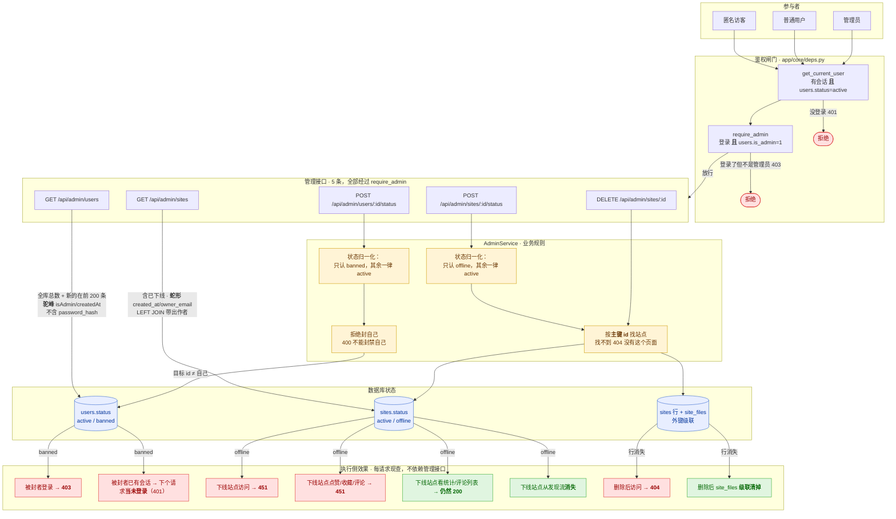
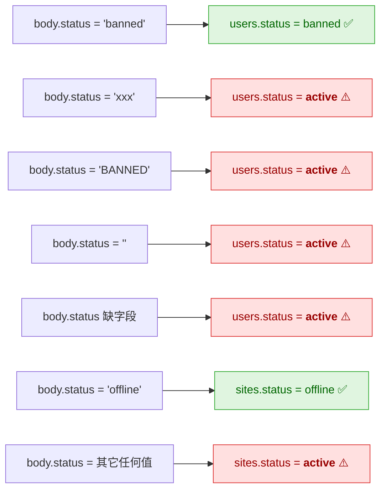

# 管理权限闭环

> 这张图是**排查用的**：管理动作出问题时，顺着图找是哪一环断了。
>
> **图与代码同步**由 `tests/test_admin_loop_doc.py` 保证 ——
> 接口增删而图没更新，那个测试会失败。所以这张图不会悄悄过期。

## 为什么需要这张图

重写过程中出现过一次真实的问题：**执行侧是完整的，管理侧却完全是空的**。

* 一个被封禁的用户，后端**真的会拦住**（登录 403、已有会话下个请求就失效）
* 但**没有任何接口能让管理员去封别人** —— 只能直接改数据库

所以「权限模块做完了」这句话是**不能只看执行侧**就下的。这张图把两侧画在一起，
任何一侧缺了都看得出来。

---

## 一、闭环全景

---

## 二、两个"归一化"是**危险的默认值**

这是整张图里最容易咬人的地方，单独画一遍：

**含义**：传 `"xxx"` 不会报 400，而是**静默解封** / **静默上线**。
原版就是这样，前端只会传那两个词，所以保持原样 ——
但**将来任何别处要调这个接口，都必须注意这个默认值**。

`tests/test_admin.py` 里有参数化用例把这两个行为**钉住**，
免得以后有人"顺手改成校验"而改掉契约。

---

## 三、出问题时怎么用这张图查

按"症状 → 顺着图往回找"的顺序：

| 症状 | 图上的位置 | 先查什么 |
|---|---|---|
| 管理员打开 `admin.html` 是**空表 + 一句错误** | `guard → api` 这一跳 | 接口是否 401/403？`is_admin` 是否为 1？ |
| 明明封了人，他**还能用** | `db → eff` 这几条边 | `users.status` 真的写成 `banned` 了吗？`get_current_user` 是否**每请求现查**？ |
| 封了人，他**重新登录还能进** | `D1 → F1` | 登录接口有没有查 `status`？ |
| 下线了站点，访问**还是 200** | `D2 → F3` | 站点状态写进去了吗？页面路由有没有读 `status`？ |
| 下线了站点，**还能点赞** | `D2 → F4` | 互动接口有没有查站点状态？ （注意取消点赞**刻意不查**） |
| 删了站点，**文件还在库里** | `D3 → F8` | 外键是不是 `ON DELETE CASCADE`？SQLite 要开 `PRAGMA foreign_keys` |
| 管理员列表里**看不到**某个站点 | `E3` | 它被删了吗？这里的列表**含已下线**，所以下线不该导致消失 |
| 管理后台**归属列全空** | `E3` 的 LEFT JOIN | 用 INNER JOIN 的话**无主站点会整行消失**；用 LEFT JOIN 才是 `None` → 前端显示「（无归属）」 |
| 用户列表里**多了个 `password_hash`** | `E1` | 出参没过 `UserOut` |

---

## 四、接口清单（这张图会被测试校验）

下面这 5 行是**权威清单**，`tests/test_admin_loop_doc.py` 拿它和
运行中的 OpenAPI 对比 —— 对不上就失败。

<!-- ADMIN_ENDPOINTS:BEGIN （测试解析这一段，别改格式） -->
| 方法 | 路径 | 鉴权 |
|---|---|---|
| GET | /api/admin/users | 管理员 |
| POST | /api/admin/users/{user_id}/status | 管理员 |
| GET | /api/admin/sites | 管理员 |
| DELETE | /api/admin/sites/{site_id} | 管理员 |
| POST | /api/admin/sites/{site_id}/status | 管理员 |
<!-- ADMIN_ENDPOINTS:END -->

---

## 五、每条边由哪个测试保证

图上的边不是画着好看的 —— 每条都有用例撑着：

| 图上的边 | 测试 |
|---|---|
| 匿名 → 401 / 普通用户 → 403 / 管理员 → 放行 | `test_admin.py::TestAdminGuard`（5 条接口逐一参数化） |
| `E1` 驼峰 + `total` 是全库总数 + 不含 `password_hash` | `TestAdminUsers` |
| `E2 → R1 → R2`（归一化 + 不能封自己 + 404） | `TestAdminUserStatus` |
| `D1 → F1`（被封者登录 403） | `TestBanTakesEffect::test_banned_user_cannot_login` |
| `D1 → F2`（已有会话下个请求掉线） | `TestBanTakesEffect::test_banned_user_loses_existing_session` |
| 解封后能登录（闭环的另一半） | `TestBanTakesEffect::test_unban_restores_login` |
| `E3` 含已下线 + 蛇形键 + LEFT JOIN 的无主站点 | `TestAdminSites` |
| `E4 → R3 → R4` | `TestAdminSiteStatus` |
| `D2 → F3`（451） / `D2 → F6`（发现流消失） / 恢复 | `TestOfflineTakesEffect` |
| `E5`（跨归属删除 + 级联 + 404） | `TestAdminDeleteSite` |
| 两个 `set_status` 不再是死代码 | `TestPreviouslyDeadCode` |

**所以：改了管理接口的行为，要么改测试要么改图** —— 两边对不上，CI 会拦下来。
