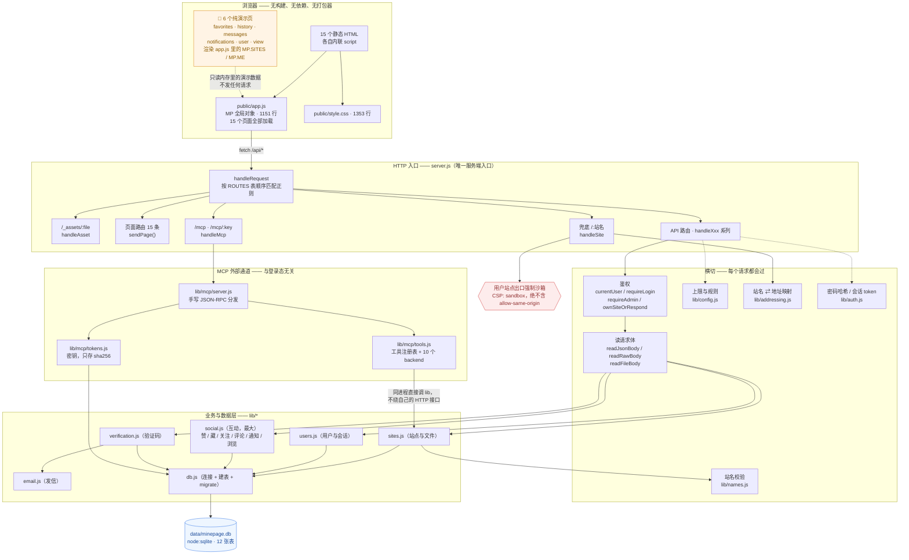

# MinePage 现状架构

> 只描述**现在是什么样**，不描述应该是什么样。不涉及重构。
> 图的约定见 [`README.md`](README.md)。

## 一句话概括

**一个文件即服务端**：`server.js`（2023 行）里一张 `ROUTES` 表挂 72 条正则路由，
其余按职责拆成 `lib/*` 共 13 个模块；前端是 15 个**无构建、无依赖**的静态 HTML，
各自内联脚本，共享一个 `public/app.js`；存储是单文件 SQLite，12 张表。

## 规模

| 部位 | 量 |
|---|---|
| 服务端 | 14 个文件、5254 行（`server.js` 占 2023 行） |
| 前端 | 15 个 HTML（3708 行）+ `app.js` 1151 行 + `style.css` 1353 行 |
| 路由 | 72 条（页面 15 · API 60 来条 · MCP 2，有重叠） |
| 数据表 | 12 张，单文件 `data/minepage.db` |
| 运行时依赖 | **1 个**（`nodemailer`）。HTTP 用 `node:http`，DB 用 `node:sqlite` |

## 架构图

## 组织方式（图里看不出来的几条）

### 1. `server.js` 是单文件单体，但内部有明确分工

- **路由表 `ROUTES`**：`[方法, 正则, handler]` 三元组数组，一个循环顺序匹配。
  捕获组会作为第三个参数传给 handler（例如 `/api/sites/([a-z0-9-]+)` 的站名）。
- **handler**：约 60 个 `handleXxx`，只做「鉴权 + 参数校验 + 拼响应」，
  真正的数据操作一律下推到 `lib/*`。
- **响应助手**：`sendJson` / `sendHtml` / `sendRedirect` / `sendPage`。

### 2. 两种「需登录」写法并存（看图时要留意）

| 写法 | 用在 | 未登录时 |
|---|---|---|
| `requireLogin(req, res)` | API | 401 JSON |
| `if (!currentUser(req)) sendRedirect(res, '/login')` | **页面路由** | 302 跳登录页 |

这两种混用是历史原因。**判断一个路由要不要登录，不能只看有没有 `requireLogin`。**

### 3. 用户站点有两条存储路径（这是历史包袱）

| 形态 | 内容存哪 | 页数 |
|---|---|---|
| 单页站（老） | `sites.html` 列 | 1 |
| 多页站（新） | `site_files.content`（BLOB） | 1~200 |

所以同一个 `index.html` 走两条路时**上限不一样**（2MB vs 10MB）。`handleSite` 里也是两条分支。

### 4. MCP 是旁路，不是第二套后端

`lib/mcp/tools.js` 的 10 个工具**直接调 `lib/sites.js`**，不经过自己的 HTTP 接口。
凭据是 `mcp_tokens` 表里的密钥（只存 sha256），**与登录 Cookie 无关**；
但权限**等同于网页登录，且只作用于密钥主人自己的站点**（管理员密钥也不例外）。

### 5. 前端没有任何状态管理层

没有组件、没有路由、没有 store。每个页面自己：
- 用内联脚本画 DOM
- 通过 `MP.*` 用共享能力（顶栏、图标、卡片、提示、登录弹窗）
- 自己 `fetch` 自己的接口

**这是"6 个页面还是演示数据"能长期藏着不被人发现的结构性原因** —— 页面之间没有共同的取数层，
每个页面各写各的，接没接只能一页一页看。

### 6. 已知的结构性问题（只记录，不在这里解决）

| 问题 | 说明 |
|---|---|
| 两份清单靠人同步 | 前端 `MP.TAGS` / 客户端登录拦截清单，各有一份和服务端对应的表，已经漂移过一次 |
| 没有取数层 | 见上第 5 条 |
| 单页站 / 多页站双轨 | 见上第 3 条，上限与行为不一致 |
| 读体超限的响应发不出去 | `readRawBody` 超限时先 `req.destroy()` 再回 413 |
| 浏览量口径粗糙 | 只在访问入口页时 +1，不去重、不防刷 |

详见本机的缺陷清单 `tests/new-findings.md`（21 条）与 `tests/issues.md`（53 条）。
**这两个文件不进 git**（`tests/` 整个目录都在本地），所以这里只写文件名、不做链接 ——
免得队友克隆下来点开是死链。链路图里已经把要紧的断点就地写清楚了。
