# MinePage 数据流（链路图）

> 按**阶段**画，不按函数画。每个节点第一行是"这一步干了什么"，第二行是"关联实现"。
> 每条链路末尾的**「断点」**是重点 —— 修的时候照它改。
> 状态标记与画法约定见 [`README.md`](README.md)。

## 分类总表

先把链路分好类。分法依据是**用户能感知的能力**，不是代码结构。

| 组 | 编号 | 链路 | 现状 |
|---|---|---|---|
| **身份** | A1 | 注册（邮箱验证码） | ✅ 通 |
| | A2 | 登录 / 登出 / 会话校验 | ✅ 通 |
| | A3 | 找回密码 / 改密码 | ✅ 通 |
| **内容供给** | B1 | 建站：单页上传 | ✅ 通 |
| | B2 | 建站：多页站文件 | ✅ 通 |
| | B3 | 站点元信息 / 编辑 / 删除 | ✅ 通 |
| **内容分发** | C1 | 发现流（搜索 / 筛选 / 排序） | ⚠️ 主列表通，侧栏假 |
| **内容消费** | C2 | 用户站点访问（沙箱渲染） | ⚠️ 站点出口通，观看页假 |
| **互动** | D1 | 点赞 / 收藏 / 关注 / 评论 | ❌ 后端全通，前端一个没接 |
| **个人** | E1 | 个人中心（收藏 / 历史 / 私信 / 通知） | ❌ 4 个页面全是假的 |
| | E2 | 创作者主页 | ❌ 后端有，前端假 |
| **运营** | F1 | 管理后台 | ✅ 通 |
| **外部** | G1 | MCP 通道 | ✅ 通 |

**一句话总结现状**：**后端该有的几乎都有了（72 条路由、12 张表），断的几乎全在前端。**

---

## A1 · 注册（邮箱验证码）

**现状**：✅ 全链路通。`login.html` 与登录弹窗共用 `MP.auth.mountForm`。

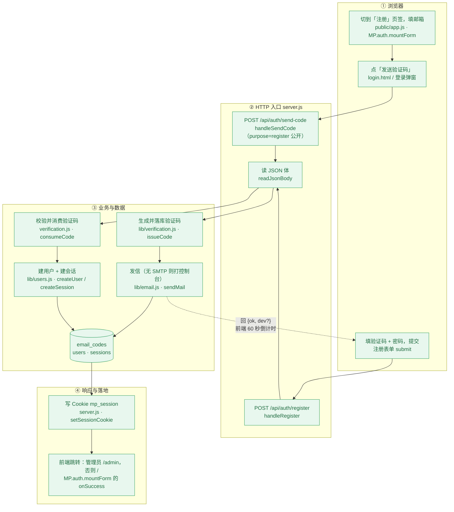

**断点**：无。两个已知隐患记在本地清单 `tests/new-findings.md` 的 N7（种子口令低于平台下限）、N8（先写库后发信，SMTP 挂了要等满 60 秒冷却）。该文件不进 git，故不做链接。

---

## A2 · 登录 / 登出 / 会话校验

**现状**：✅ 通。顶栏是**真实用户**，未登录点受保护入口**弹窗**而不跳页。

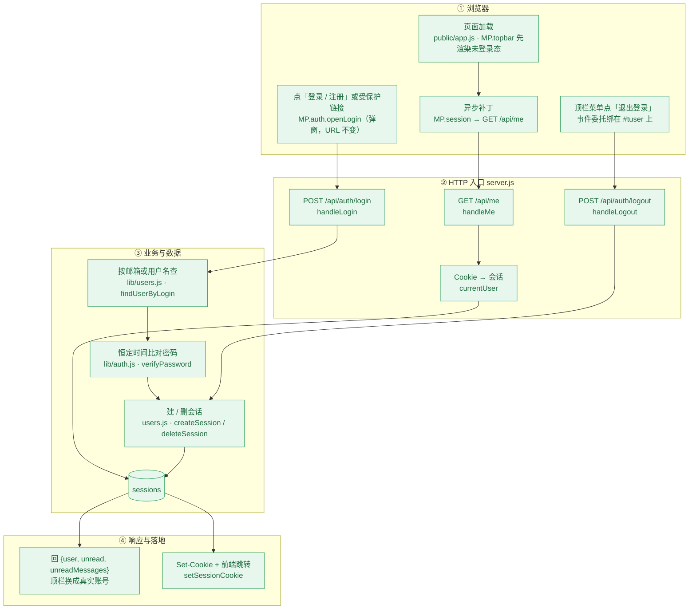

**断点**：无。

**注意**：`GET /api/me` 是**公开**路由（未登录回 `user: null`，不是 401）。
所以「有没有登录」在前端要靠 `MP.session()` 的结果判断，不能靠状态码。

---

## A3 · 找回密码 / 改密码

**现状**：✅ 通。但**两个改密入口行为不一致**。

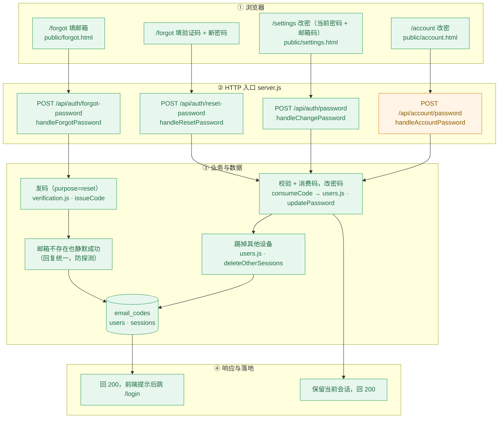

**断点**：无功能断裂。但 `POST /api/account/password`（A4 那条）**不校验邮箱验证码、也不踢其他会话**，
与 `/api/auth/password` 行为不同 —— 同一个「改密码」有两个入口两套规则。

---

## B1 · 建站：单页上传

**现状**：✅ 通（含 2 MB 上限拦截）。

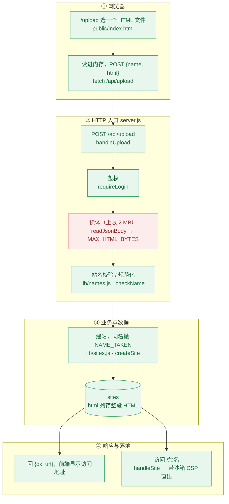

**断点**：

| # | 现象 | 依据 |
|---|---|---|
| 1 | **超过 2 MB 时客户端拿到的是 `socket hang up` 而不是 413** —— `readRawBody` 超限先 `req.destroy()` 再回 413，连接已断，413 发不出去 | 回归里的已知失败 `BC-11` |

---

## B2 · 建站：多页站文件

**现状**：✅ 通（4 个文件的多页站在库里跑着）。

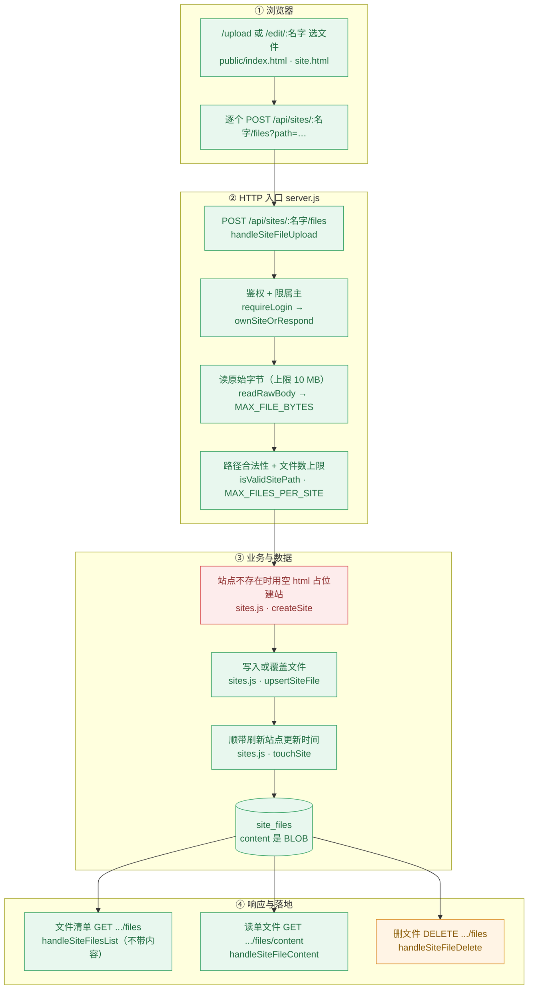

**断点**：

| # | 现象 | 依据 |
|---|---|---|
| 1 | **站名含大写时这条路走不通**：路由正则 `([a-z0-9-]+)` 只认小写 → 匹配不上任何路由 → 返回 404 HTML → 前端按 JSON 解析失败显示「网络出问题了」。而同一个站名走**单页**上传却成功（`checkName` 会转小写）。 | 已知失败 `BC-21` |
| 2 | **同一份 `index.html` 两条路上限差 5 倍**：走单页通道限 2 MB，走这条文件通道限 10 MB | `B1` 的 B3 vs 本图 B3 |
| 3 | **先建站、后读请求体**：上传中断或正文为空会留下 `html=''`、0 文件的**空站点**，访问它只 404 | `new-findings.md` N11 |
| 4 | **判「文件是否存在」要把整个 BLOB 读出来**：覆盖 10 MB 文件前先读 10 MB | N12 |
| 5 | 删文件**不刷新** `sites.updated_at`（写文件会刷新），所以删文件不会让站点在「最近更新」排序里冒头 | N9 |

---

## B3 · 站点元信息 / 编辑 / 删除

**现状**：✅ 通。

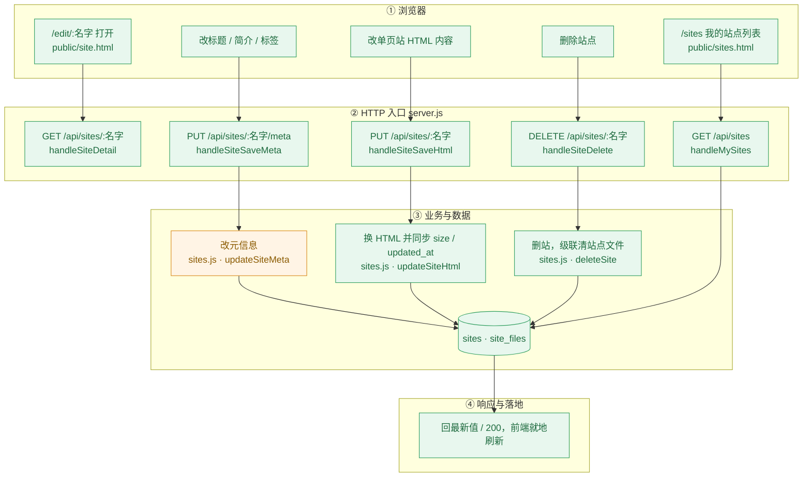

**断点**：无功能断裂。`updateSiteMeta` **不刷新** `updated_at`（而 `updateSiteHtml` 刷新）——
改标题、改简介不会让站点在发现流的「最近更新」排序里冒头（N9）。

---

## C1 · 发现流（搜索 / 标签筛选 / 排序）

**现状**：⚠️ **主列表已经是真实数据**（2026-10 接线），但**侧栏还是演示数据**。

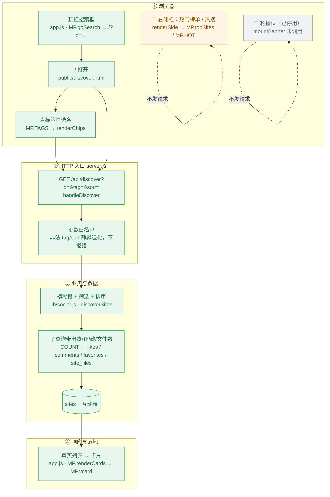

**断点**：

| # | 现象 | 依据 |
|---|---|---|
| 1 | **右侧栏与主列表口径不一致**：主列表是真实站点（浏览量 0~3），侧栏「热门榜单」还是写死的 6.8 万、「热搜」128.6 万。点侧栏会进 `/view/<演示站名>` | `discover.html` 的 `renderSide()` |
| 2 | **`/api/hot` 不存在**，`app.js` 里有条 TODO 说要用它 | `app.js` 的 `MP.HOT` 上方 |
| 3 | **轮播位被停用**（`mountBanner()` 未调用）：它指向的三个站点库里不存在，图片还是外部第三方地址 | `discover.html` 末尾注释 |
| 4 | **「排行榜」入口本身是坏的**：顶栏指向 `/?sort=rank`，而 `rank` 不在服务端白名单里，会静默退化为默认排序（即和首页同一个列表）。目前在前端被显式映射成 `sort=views` 兜住 | `discover.html` 的 `reload()` |
| 5 | 搜索**不匹配作者名**（只匹配标题 / 简介 / 站名），而前端的演示数据版本会匹配 | `discoverSites` 的 SQL |

---

## C2 · 用户站点访问（沙箱渲染 + 浏览量）

**现状**：⚠️ **站点出口是通的**（能访问、带沙箱、计数），但**观看页 `view.html` 还是演示页**。

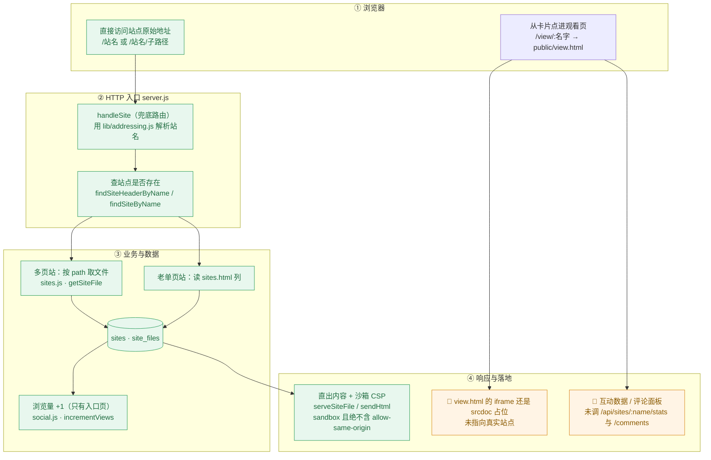

**断点**：

| # | 现象 | 依据 |
|---|---|---|
| 1 | **观看页 `view.html` 不请求任何接口**（9 处 `TODO 后端对接`）：iframe 是 `srcdoc` 占位、互动数字和评论都是内存数组 | `view.html` |
| 2 | 因为 iframe 没指向真实站点，**从观看页进去不会产生浏览量**（只有直接访问 `/站名` 才会） | 本图 C3 的触发条件 |
| 3 | 浏览量口径粗糙：只在入口页 +1，子资源不算，**不去重、不防刷**，同一个人刷新也照加 | `incrementViews` |

---

## D1 · 社区互动（点赞 / 收藏 / 关注 / 评论）

**现状**：❌ **后端全通、表都在，前端一个都没接。**

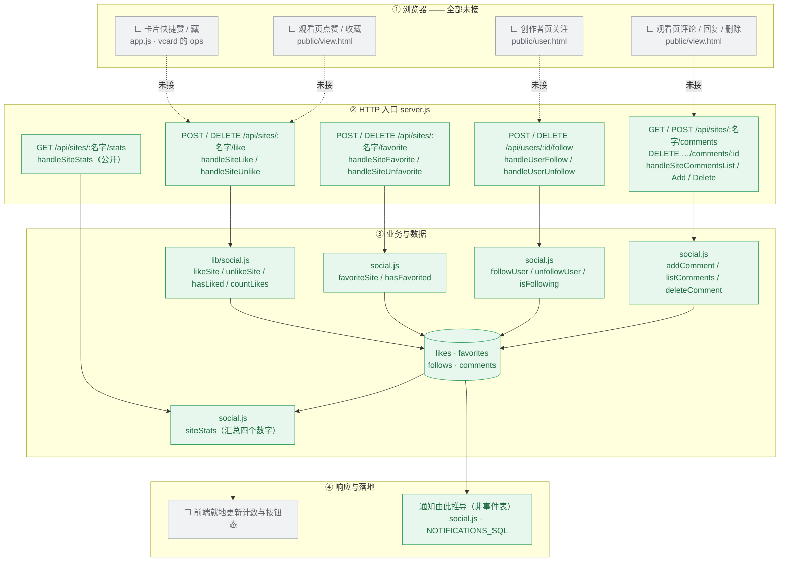

**断点**：

| # | 现象 | 依据 |
|---|---|---|
| 1 | **卡片上的快捷赞 / 藏按钮只改内存**，刷新即复原（`app.js` 里有 TODO 指向 `/api/sites/:name/like \| /favorite`） | `app.js` · `vcard` |
| 2 | 观看页的点赞、收藏、评论、回复、删除**全部是内存数组** | `view.html` |
| 3 | 创作者页的「+ 关注」也是内存状态 | `user.html` |
| 4 | 前端的**权限判断用的是写死的演示身份**（`MP.ME`），所以真实作者看不到自己评论的删除按钮、任何访客都能删演示评论 | `new-findings.md` N2 |

---

## E1 · 个人中心（我的站点 / 收藏 / 历史 / 私信 / 通知）

**现状**：❌ **5 个页面里只有「我的站点」是真的，其余 4 个全是演示数据。**

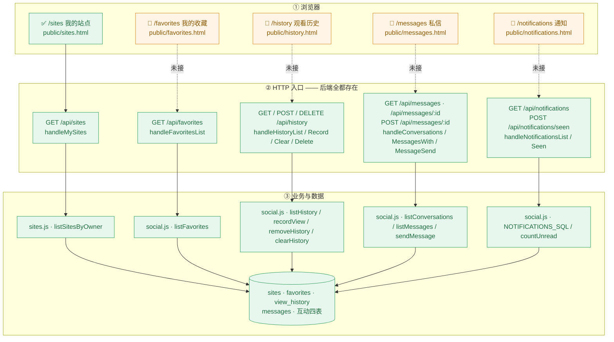

**断点**：

| # | 页面 | 现象 |
|---|---|---|
| 1 | `/favorites` | 渲染 `MP.SITES` 现算的假收藏夹；`GET /api/favorites` 存在但没人调。且服务端**没有收藏夹模型**（只有一个平铺列表），页面上的「新建收藏夹」做不出来 |
| 2 | `/history` | `records = MP.SITES.slice(0,9)`；整套 `/api/history` 没人调。「只保留最近 30 天」是内存文案 |
| 3 | `/messages` | 页内 `CONVS` 数组；自己的身份取 `MP.ME`（演示用户），与真实登录态不一致 |
| 4 | `/notifications` | 页内 `items` 数组；服务端连「未读数」都已经算好了（`MP.session()` 里的 `unread`），只是页面不用 |

---

## E2 · 创作者主页

**现状**：❌ **后端接口可用（实测 200），前端是演示页。**

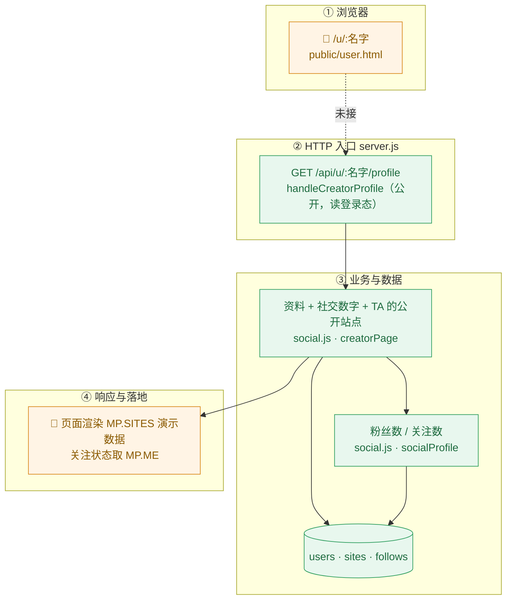

**断点**：`user.html` 完全不发请求。而且它用 `MP.ME` 判断「是不是我自己」，
所以**真实用户打开自己的主页会看到「+ 关注」而不是「编辑资料」**（N2）。

---

## F1 · 管理后台

**现状**：✅ 通。

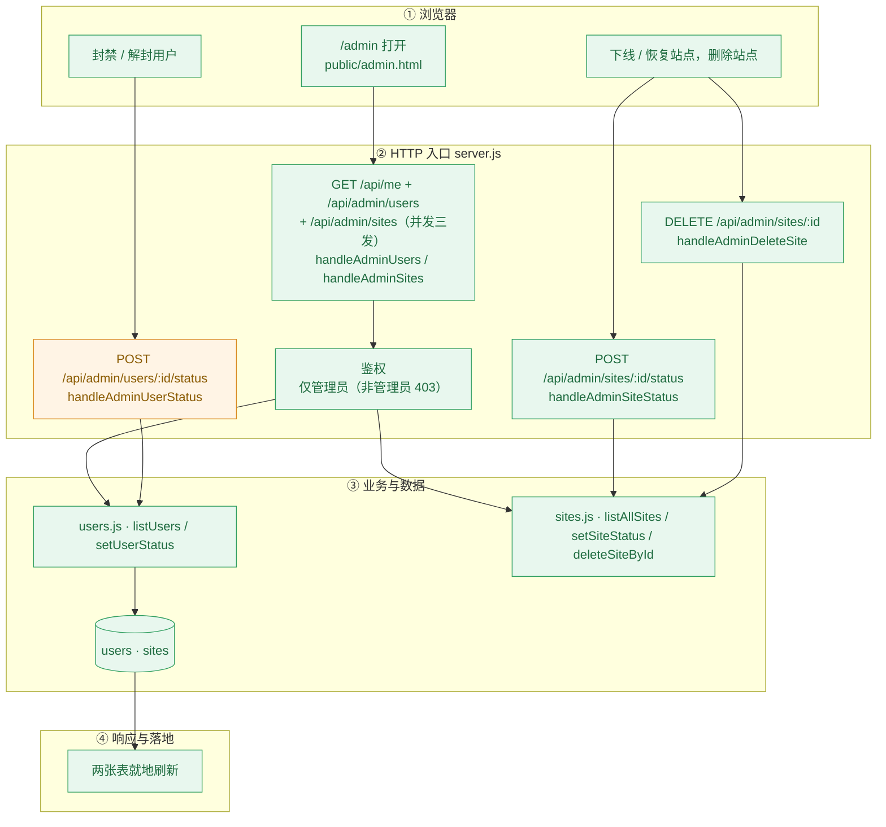

**断点**：无功能断裂。**封禁不吊销会话**（登录态在 `currentUser` 里按 `status` 现查，所以行为上是对的，
只是 `sessions` 表里留着行）。

---

## G1 · MCP 通道

**现状**：✅ 通。**与登录 Cookie 无关的第二条凭据通道。**

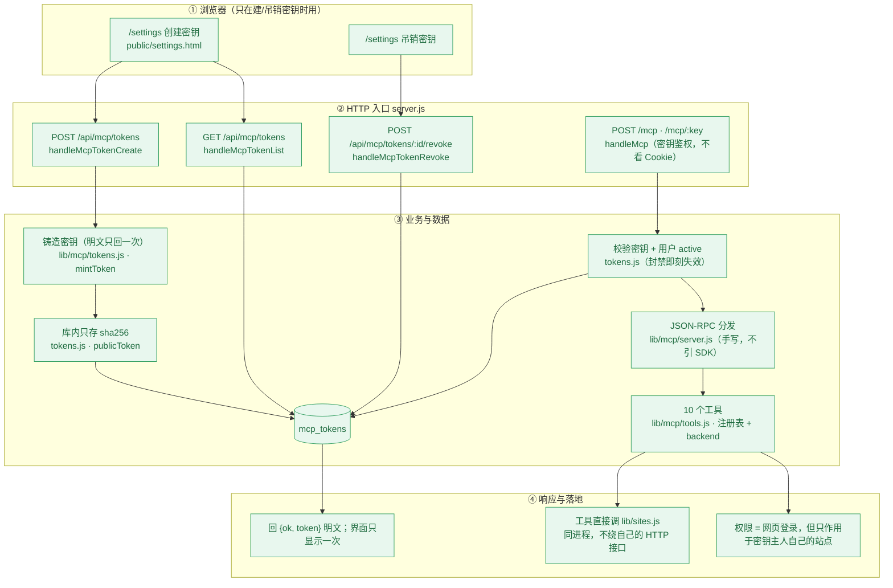

**断点**：无功能断裂。三个细节见 `new-findings.md` 的 N20（无 id 的通知也会收到响应、超限 413 送不到、密钥上限判断非原子）。

---

## 汇总：断在哪

按「修起来值不值」排序。**判断标准是：这条断点会不会在后续接线中被顺带重写掉。**

### 一、前端没接（占绝大多数，都是"后端已就绪、前端未调"）

| 链路 | 未接的页面 | 后端状态 |
|---|---|---|
| D1 社区互动 | `view.html`、`user.html`、`app.js` 卡片 | ✅ 4 张表 + 全部接口可用 |
| E1 个人中心 | `favorites` `history` `messages` `notifications` | ✅ 接口全在 |
| E2 创作者主页 | `user.html` | ✅ 实测 200 |
| C2 观看页 | `view.html` 的 iframe 与互动区 | ✅ stats / comments 可用 |

**共 6 个页面是"能看但假"**，全部集中在 D1 / E1 / E2 / C2。

### 二、后端与前端口径不一致

| # | 现象 |
|---|---|
| 1 | 发现流**主列表真实、侧栏演示**，两套数字并排显示 |
| 2 | `discover.html` 的轮播位被停用（指向的站点不存在） |
| 3 | 顶栏「排行榜」指向的 `sort=rank` 不在服务端白名单里（目前前端硬映射兜住） |
| 4 | 搜索不匹配作者名，而前端的演示数据版本会匹配 |

### 三、后端自身的缺陷（**不会**被前端接线顺带修掉，值得单独修）

`BC-11`（超限 413 发不出去）、`BC-21`（站名大写走不通多文件接口）、
2MB/10MB 两条路不一致、先建站后读体、`updated_at` 刷新不对称、封禁不吊销会话、
`readBody` 遇 falsy 请求体挂起（N1）。

完整清单在本地（不进 git，故不做链接）：`tests/new-findings.md`（本轮新发现 21 条）+ `tests/issues.md`（上一轮 53 条）。
上面每个「断点」小节已经把这轮相关的部分就地写全了，不必跳出去看。
