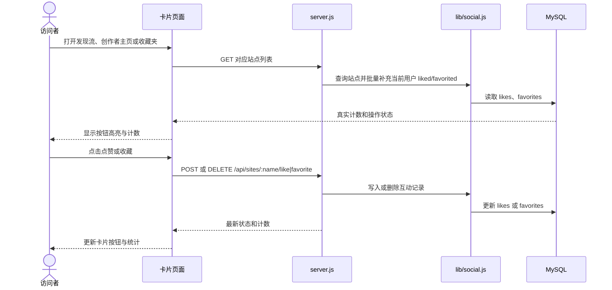

# 站点卡片：真实点赞与收藏

```mermaid
sequenceDiagram
  actor V as 访问者
  participant P as 卡片页面
  participant S as server.js
  participant L as lib/social.js
  participant DB as MySQL

  V->>P: 打开发现流、创作者主页或收藏夹
  P->>S: GET 对应站点列表
  S->>L: 查询站点并批量补充当前用户 liked/favorited
  L->>DB: 读取 likes、favorites
  DB-->>P: 真实计数和操作状态
  P-->>V: 显示按钮高亮与计数

  V->>P: 点击点赞或收藏
  P->>S: POST 或 DELETE /api/sites/:name/like|favorite
  S->>L: 写入或删除互动记录
  L->>DB: 更新 likes 或 favorites
  S-->>P: 最新状态和计数
  P-->>V: 更新卡片按钮与统计
```

验收：匿名点击提示登录；登录后点赞、收藏、取消操作均持久化，刷新后按钮与数字一致；失败时保留旧状态。收藏夹里取消收藏后重拉列表。封面可点击进入观看页。
