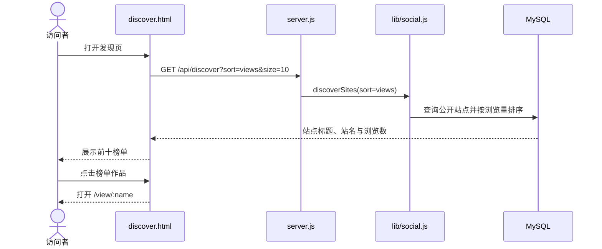

# 发现页：按浏览量的真实榜单

```mermaid
sequenceDiagram
  actor V as 访问者
  participant P as discover.html
  participant S as server.js
  participant L as lib/social.js
  participant DB as MySQL

  V->>P: 打开发现页
  P->>S: GET /api/discover?sort=views&size=10
  S->>L: discoverSites(sort=views)
  L->>DB: 查询公开站点并按浏览量排序
  DB-->>P: 站点标题、站名与浏览数
  P-->>V: 展示前十榜单
  V->>P: 点击榜单作品
  P-->>V: 打开 /view/:name
```

验收：榜单只显示公开站点，顺序与数据库浏览数一致；无作品时显示空态，接口失败显示错误。热搜与轮播没有数据源，移除发现页和顶栏的占位节点；编辑页移除尚未接入的智能体按钮。
