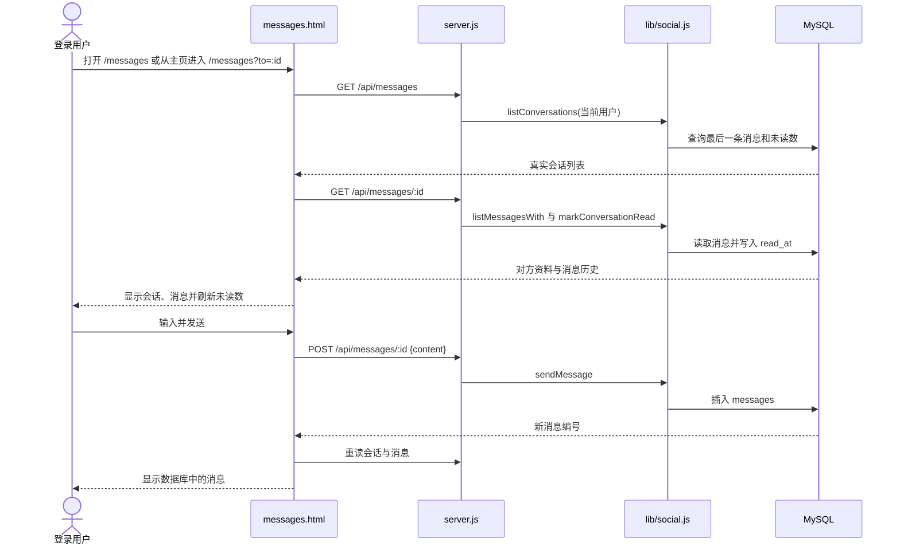

# 私信：会话、阅读与发送

```mermaid
sequenceDiagram
  actor U as 登录用户
  participant P as messages.html
  participant S as server.js
  participant L as lib/social.js
  participant DB as MySQL

  U->>P: 打开 /messages 或从主页进入 /messages?to=:id
  P->>S: GET /api/messages
  S->>L: listConversations(当前用户)
  L->>DB: 查询最后一条消息和未读数
  DB-->>P: 真实会话列表
  P->>S: GET /api/messages/:id
  S->>L: listMessagesWith 与 markConversationRead
  L->>DB: 读取消息并写入 read_at
  DB-->>P: 对方资料与消息历史
  P-->>U: 显示会话、消息并刷新未读数

  U->>P: 输入并发送
  P->>S: POST /api/messages/:id {content}
  S->>L: sendMessage
  L->>DB: 插入 messages
  DB-->>P: 新消息编号
  P->>S: 重读会话与消息
  P-->>U: 显示数据库中的消息
```

验收：从创作者主页可进入新会话；已有会话、最后一条消息和未读数来自 MySQL；打开会话后标记已读；发送后重读数据库，刷新页面消息仍在；失败时保留输入且不显示虚假的发送成功。
