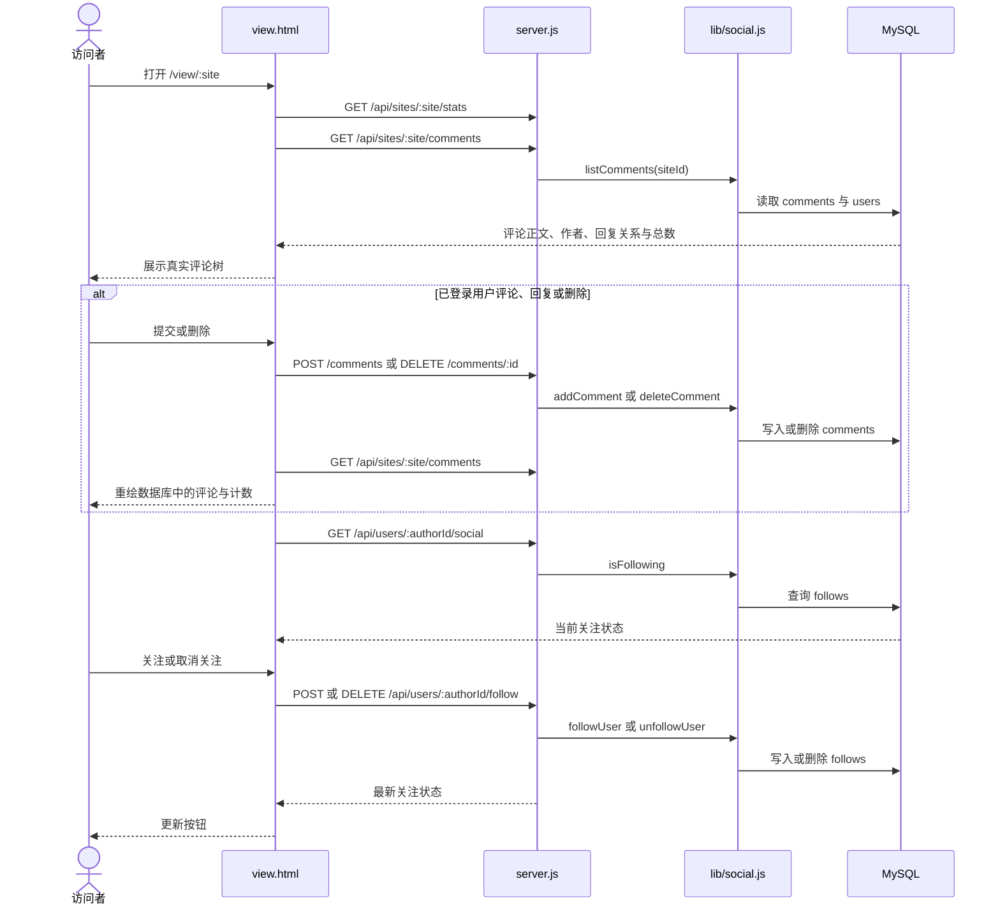

# 作品观看页：评论与关注

```mermaid
sequenceDiagram
  actor V as 访问者
  participant P as view.html
  participant S as server.js
  participant L as lib/social.js
  participant DB as MySQL

  V->>P: 打开 /view/:site
  P->>S: GET /api/sites/:site/stats
  P->>S: GET /api/sites/:site/comments
  S->>L: listComments(siteId)
  L->>DB: 读取 comments 与 users
  DB-->>P: 评论正文、作者、回复关系与总数
  P-->>V: 展示真实评论树

  alt 已登录用户评论、回复或删除
    V->>P: 提交或删除
    P->>S: POST /comments 或 DELETE /comments/:id
    S->>L: addComment 或 deleteComment
    L->>DB: 写入或删除 comments
    P->>S: GET /api/sites/:site/comments
    P-->>V: 重绘数据库中的评论与计数
  end

  P->>S: GET /api/users/:authorId/social
  S->>L: isFollowing
  L->>DB: 查询 follows
  DB-->>P: 当前关注状态
  V->>P: 关注或取消关注
  P->>S: POST 或 DELETE /api/users/:authorId/follow
  S->>L: followUser 或 unfollowUser
  L->>DB: 写入或删除 follows
  S-->>P: 最新关注状态
  P-->>V: 更新按钮
```

验收：评论、回复、删除、计数和关注状态刷新后与数据库一致；匿名互动提示登录，失败时保留输入和旧状态。无后端数据模型的投币与评论点赞入口移除；分享只有复制成功才提示成功。
