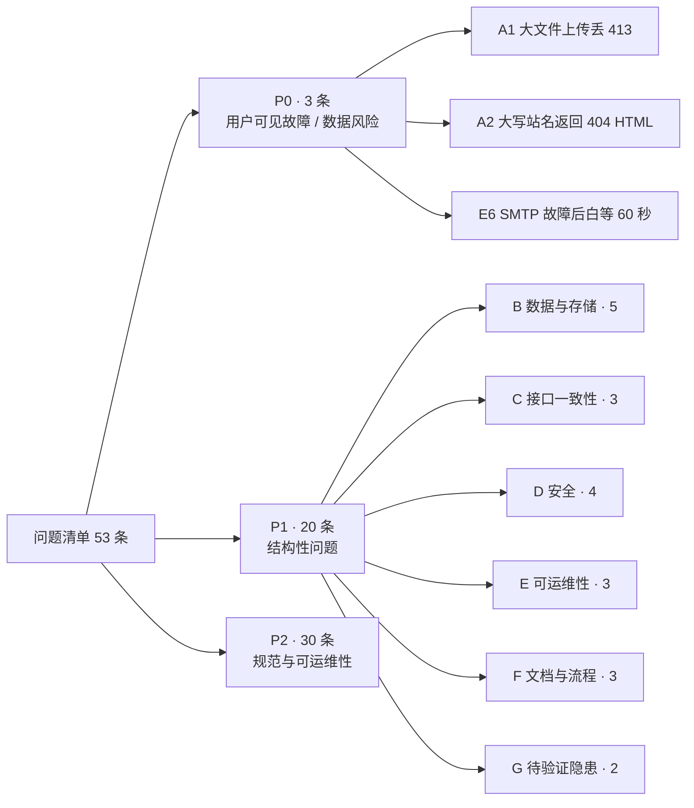
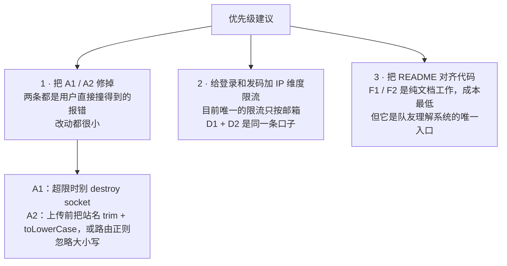

# MinePage 当前问题清单

基线：`b2d6bf0`（旧 Node 版）。**本文件已进版本控制** ——
原先它只放在本地的 `tests/` 里，重写时提升到了 `docs/rewrite/`，和 `new-findings.md` 放在一起。
架构背景见 [architecture.md](architecture.md)，链路见 [flows.md](flows.md)，已跑实的缺陷见 [findings.md](findings.md)。

**共 53 条：P0 三条、P1 二十条、P2 三十条。**

分级口径：

- **P0** 会造成用户可见的故障，或存在数据风险
- **P1** 结构性问题，不改就会持续产生摩擦
- **P2** 规范与可运维性，不影响当下功能

---

## A · 已验证的缺陷（2 条）

由 `tests/scripts/boundary.mjs` 跑出来的断言失败，不是代码审阅的推测。

| 编号 | 问题 | 证据 / 位置 | 影响 | 级别 |
|---|---|---|---|---|
| A1 | 超过 10 MB 的站点文件，客户端收到的是 `socket hang up`，不是 413 | `server.js` `readRawBody` 超限时先 `reject` 再 `req.destroy()`，socket 已断，413 写不出去 | 界面显示「网络出问题了」，而正确文案「文件太大了，单个文件上限 10 MB」代码里已写好 | **P0** |
| A2 | 站名含大写时，多页上传请求打不到路由，返回 404 的 HTML | 上传页原样拼 URL（不转小写），路由正则 `/^\/api\/sites\/([a-z0-9-]+)\/files$/` 只认小写；前端对 HTML 调 `res.json()` 抛错 | 界面显示「网络出问题了」；同一个站名走单页模式却会成功，两种模式行为不一致 | **P0** |

---

## B · 数据与存储（9 条）

| 编号 | 问题 | 证据 / 位置 | 影响 | 级别 |
|---|---|---|---|---|
| B1 | 「站点内容」有两个存放处：`sites.html` 列和 `site_files` 表 | `db.js` 建表；`sites.js` 两套函数并存 | 同一概念两处状态，读写都要分支 | **P1** |
| B2 | 「单页还是多页」不落库，靠现算 `文件数 > 0`，且在 5 处各算一遍 | 列表、详情、拒绝单页保存、取回回落、体积相加 | 想加第三种形态要改所有这些点 | **P1** |
| B3 | `sites.html` 是 `NOT NULL`，多页站建站时被塞一个空字符串占位 | `server.js` `createSite({ html: '' })` | 该列同时承载「真实单页内容」与「占位符」两种语义 | **P1** |
| B4 | **单站总体积无上限**：200 个文件 × 单文件 10 MB = 单站最多 2 GB | `config.js` 有 `MAX_FILES_PER_SITE` 与 `MAX_FILE_BYTES`，但没有累计校验 | 一个账号就能把库撑爆；`totalSize` 只用于展示，不参与限制 | **P1** |
| B5 | 外键 `sites.owner_id ON DELETE SET NULL` 是**死配置**——平台根本没有删用户的入口 | `users.js` 无 `deleteUser`；管理后台只有封禁/解封 | 一旦将来加删除功能，会一次性产生一批无主站点，而站点没有清理机制 | P2 |
| B6 | 没有内容版本、没有备份策略 | 全库 | 用户误删站点即永久丢失；`/edit` 的删除按钮无二次确认之外的兜底 | **P1** |
| B7 | 过期会话只在**进程启动时**清理一次 | `server.js` `listen` 回调里调 `deleteExpiredSessions()` | 长期运行的进程里 `sessions` 会持续堆积 | P2 |
| B8 | 覆盖文件前，为了判断「是不是新文件」，先把同路径的 BLOB 整个读出来 | `server.js` `getSiteFile(site.id, filePath) === null` | 覆盖一个 10 MB 文件要先读 10 MB，纯浪费 | P2 |
| B9 | 站点内容以 BLOB 存库，库会随内容单调膨胀，无归档 / VACUUM 策略 | `site_files.content BLOB` | 单文件数据库越用越大，删除不回收空间 | P2 |

---

## C · 接口与行为一致性（8 条）

| 编号 | 问题 | 证据 / 位置 | 影响 | 级别 |
|---|---|---|---|---|
| C1 | 「修改密码」有两份实现，行为不一致：`/settings` 要邮箱验证码且踢其他会话；`/account` 只要旧密码且不踢 | `server.js` `handleChangePassword` vs `handleAccountPassword` | 用户从哪个入口进，安全强度不同；`/account` 还**不校验**新旧密码是否相同 | **P1** |
| C2 | 找回密码有两个完全重复的入口：`/api/auth/forgot-password` 与 `send-code?purpose=reset` | `server.js` 两个处理器都在调 `issueCode(email, 'reset')` | 同一能力两条路，将来改规则要改两处 | P2 |
| C3 | `/settings` 和 `/account` 都提供「改密」，界面上没有任何说明区分二者 | `settings.html`、`account.html` | 用户无法知道该用哪个 | P2 |
| C4 | `users.bio` **只写不读** | 唯一读取位置是 `/account` 自己的身份卡片 | 字段没有出口，等于装饰；文档里却写着「之后会展示在社区里」 | **P1** |
| C5 | 用户名只用于登录，平台内没有任何其他出口 | `setUsername` 写入后无消费方 | 改用户名不影响任何 URL，也不影响站点的归属展示 | P2 |
| C6 | 管理后台的用户/页面列表硬编码上限 200，**没有分页** | `listUsers({limit:200})`、`listAllSites({limit:200})`，处理器调用时不传参 | 超过 200 之后，后台只能看到总数、看不到剩下的条目，也无法操作 | **P1** |
| C7 | 错误响应没有错误码，前端只能匹配中文文案 | 响应统一是 `{ok:false, message}`，`message` 直接来自内部异常或硬编码字符串 | 文案一改，前端的判断就静默失效；有些内部错误直接落到顶层 catch 变成 500 | P2 |
| C8 | 单页 / 多页的判定条件写在前端且很隐晦：`来源不是文件夹 && 恰好 1 个文件 && 后缀是 .html` | `public/index.html` | 用户选了一个 `.htm` 之外的单文件会被当成多页，然后因缺 `index.html` 被拒 | P2 |

---

## D · 安全（11 条）

| 编号 | 问题 | 证据 / 位置 | 影响 | 级别 |
|---|---|---|---|---|
| D1 | 登录、注册、上传**都没有任何速率限制** | 全站只有验证码带 60 秒冷却 | 可无限次暴力猜密码；可无限次尝试注册 | **P1** |
| D2 | 验证码冷却只按「邮箱 + 用途」，**没有 IP 维度** | `verification.js` 查最近一条的时间差 | 换邮箱即可绕过；可被用来刷邮件、消耗 SMTP 配额 | **P1** |
| D3 | 注册发码时明确回 409「这个邮箱已经注册过了」，而重置密码做了防探测 | `handleSendCode` 的 register 分支 | 邮箱枚举：可批量探测哪些邮箱在平台注册过；与 reset 的策略不一致 | **P1** |
| D4 | 密码只要求 ≥ 6 位，无强度要求、无常见弱密码拦截 | `config.js` `PASSWORD_MIN = 6` | `123456` 合法 | P2 |
| D5 | 会话无轮换、无设备管理、用户无法查看或吊销自己的在线会话 | `sessions` 表只有 token / 时间 | 账号被盗后用户看不到异常登录，也无法定点踢出 | P2 |
| D6 | 没有 CSRF token，完全依赖 `SameSite=Lax` | `auth.js` `buildCookie` | 状态变更都是 POST/PUT/DELETE，Lax 基本够用，但这是**隐式依赖**，没写进任何文档 | P2 |
| D7 | 缺常见安全响应头：HSTS、X-Frame-Options、Referrer-Policy 都没有 | `sendHtml` 只加 `X-Content-Type-Options` | 平台页面理论上可被 iframe 嵌套（点击劫持） | P2 |
| D8 | 管理员默认口令 `admin` / `123`，只在库空时创建 | `config.js` / `users.js` `ensureAdminAccount` | 部署后忘记改就等同于无认证；README 提醒了，但没有强制 | **P1** |
| D9 | 只有 `.html / .htm / .svg / .xml` 加沙箱 CSP，`.js / .json / .pdf` 等不加 | `server.js` `serveSiteFile` 的 `isDoc` 判定 | 有意为之，但依赖浏览器对 `nosniff` + 顶层导航的处理；属隐式安全假设 | P2 |
| D10 | 封禁用户**不吊销会话**，而是每次请求现查 `status` | `setUserStatus` 只改状态；`currentUser` 每次比对 | 被封用户的 token 仍然有效地留在库里，直到 30 天过期 | P2 |
| D11 | 上传内容不做任何审查，全靠沙箱隔离 | 无内容扫描、无举报入口、无自动处置 | 恶意/违规页面可长期托管，管理后台只能人工逐个下线 | P2 |

---

## E · 可运维性（9 条）

| 编号 | 问题 | 证据 / 位置 | 影响 | 级别 |
|---|---|---|---|---|
| E1 | 没有日志系统，只有 `console.log` / `console.error` | 全站 | 线上出问题无法追溯；没有请求日志、没有错误聚合 | **P1** |
| E2 | 没有健康检查端点 | 路由表里没有 `/health` | 无法做存活探测或负载均衡健康检查 | P2 |
| E3 | 没有指标，没有监控 | 全站 | 不知道 QPS、错误率、发信成功率 | P2 |
| E4 | 没有自动化测试 | README 自己承认；`tests/` 是本地未跟踪的一次性用例 | 每次改动都靠手工点，回归全靠人记 | **P1** |
| E5 | 没有 lint / 格式化配置 | 仓库无 `.eslintrc` / `.prettierrc` | 风格靠自觉，`server.js` 已经 1257 行 | P2 |
| E6 | SMTP 故障时，发码接口会 500，**且用户要白等满 60 秒** | `verification.js` 先写库、再 `await sendMail` | 邮件服务一挂，注册和找回密码全部不可用，且重试还被冷却挡住 | **P0** |
| E7 | 数据库依赖 Node 的实验特性 `node:sqlite` | `db.js`；启动必打 `ExperimentalWarning` | Node 大版本升级可能破坏 API | P2 |
| E8 | 没有备份策略 | 全库一个 sqlite 文件 | 文件损坏即全站数据丢失 | **P1** |
| E9 | 配置全靠环境变量，没有 `.env` 支持 | `config.js` 直接读 `process.env` | 本地开发要手工传一串变量；`.gitignore` 里排除的 `start.cmd` 就是为此存在的本地脚本 | P2 |

---

## F · 文档与流程（8 条）

| 编号 | 问题 | 证据 / 位置 | 影响 | 级别 |
|---|---|---|---|---|
| F1 | README 的接口表只有 15 条，实际路由表 35 条 + 1 条兜底 | `README.md` vs `server.js` `ROUTES` | 缺 21 条：验证码、找回/重置密码、账号自助、站点详情/元信息/文件增删查 | **P1** |
| F2 | README 写着「三张表」，实际是 5 张 | `README.md` vs `db.js` | `email_codes`、`site_files` 完全没提；`users.bio`、`sites.title/description/tag` 也没进表说明 | **P1** |
| F3 | README 的结构清单缺 3 个前端文件 | `README.md` | 缺 `public/account.html`、`sites.html`、`site.html` | P2 |
| F4 | README 没有记录验证码参数（60 秒 / 10 分钟 / 5 次）、站点文件上限（200 个 / 10 MB）、路径规则 | `README.md` | 这些约束只活在代码里，新人和外部对接者看不到 | P2 |
| F5 | 项目内部决策放在**被 gitignore 的文件**里 | `.gitignore` 排除 `AGENTS.md`，注释写着「含项目内部决策」 | 队友 clone 下来看不到；文档缺口的结构性根因 | **P1** |
| F6 | 提交粒度失控：`53fc9e5` 一次提交横跨 3 个特性、+2056 行 | `git show --stat 53fc9e5` | review 和回滚都不可能 | P2 |
| F7 | commit 标题与内容不符：标题写「站点元信息与个人简介」，正文才承认「同时包含此前未提交的多页上传与页面管理改造」 | `git show -s --format=%B 53fc9e5` | 按标题检索历史会漏掉整个多页上传特性 | P2 |
| F8 | 没有需求契约类文档：无接口定义文件、无数据字典 | 仓库 | 前后端约定只存在于代码里 | P2 |

---

## G · 未验证的隐患（6 条）

这些是**从代码推断出来、但没实测过**的。需要验证的不要当成结论用。

| 编号 | 问题 | 推断依据 | 验证方式 | 级别 |
|---|---|---|---|---|
| G1 | `POST /api/upload` 的超大 JSON 大概也拿不到 413 | `readJsonBody` 与 `readRawBody` 是同一段超限写法（先 `reject` 再 `req.destroy()`） | 给 `boundary.mjs` 加一条对 `/api/upload` 的超限用例 | **P1** |
| G2 | 保留字新增 `sites` 只拦新建、不查存量，老库里叫 `sites` 的站点会被平台路由遮挡 | `config.js` 的 `RESERVED` 只在 `checkName` 里用，没有数据检查 | 查库：`SELECT name FROM sites WHERE name IN (...)` 对照 `RESERVED` | **P1** |
| G3 | `edit` 没进保留字，名为 `edit` 的站点，其子路径 `/edit/xxx` 会被编辑页路由抢走 | 路由表明细 | 建一个叫 `edit` 的站点，带上一个子页面访问试试 | P2 |
| G4 | 并发注册同一邮箱：验证码已被消费，`createUser` 撞 UNIQUE 抛错 → 500 | `handleRegister` 先 `consumeCode` 再 `createUser`，没有捕获 UNIQUE | 两个请求同时打同一邮箱 | P2 |
| G5 | 多页上传是前端逐个文件发请求，中途失败会留下「半个站点」 | `public/index.html` 的循环上传，失败即 return | 上传中途断网，再看站点文件数 | P2 |
| G6 | 多页站页面里 `localStorage`、Cookie、同源 `fetch` 全部不可用 | 沙箱 CSP 不含 `allow-same-origin`（**设计如此**） | 用 `fixtures/probe.html` 实测 | P2 |

---

## 如果只修三件事

第一二件是**改动小、风险低、收益直接可见**的；第三件是**唯一能阻止下一个提交继续跑偏**的。
